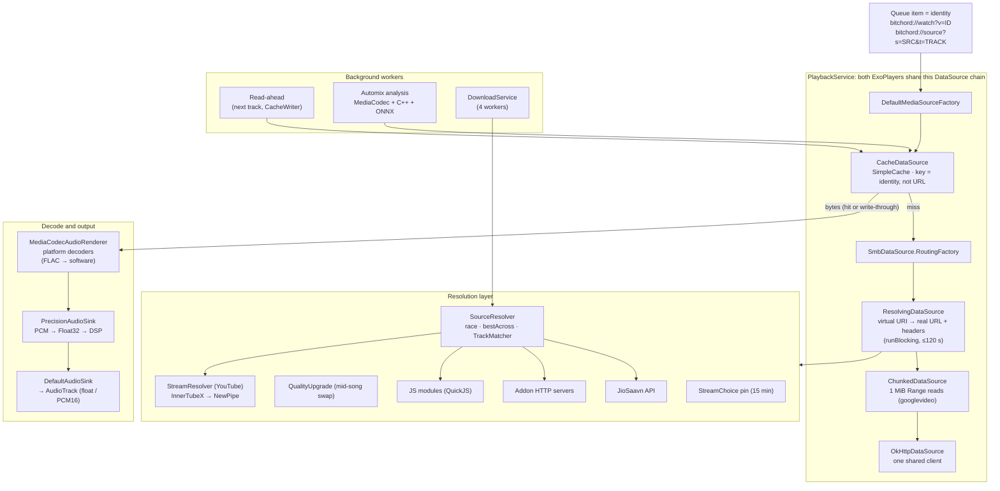
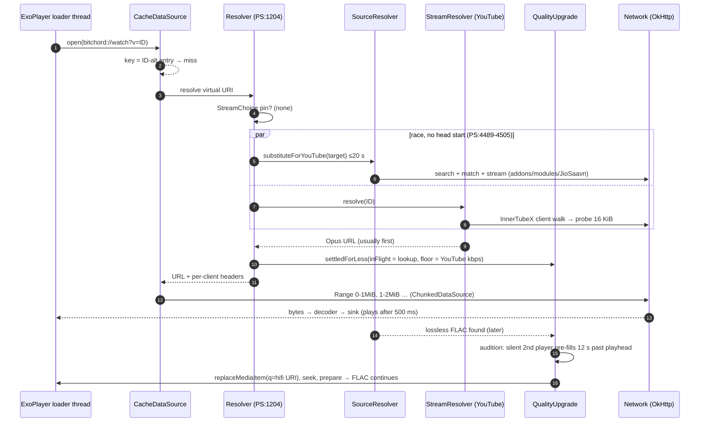
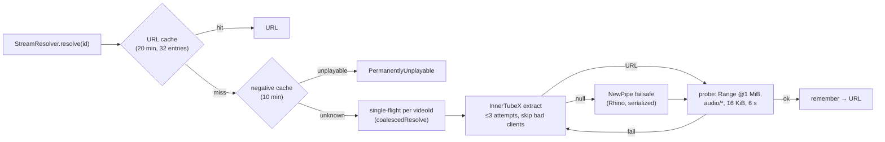
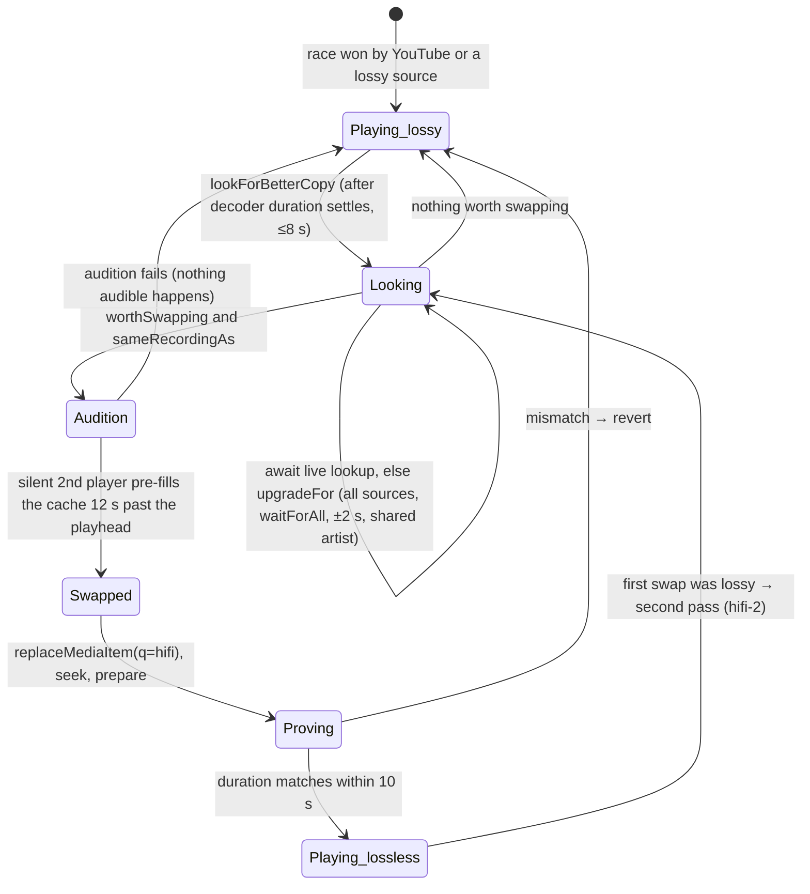
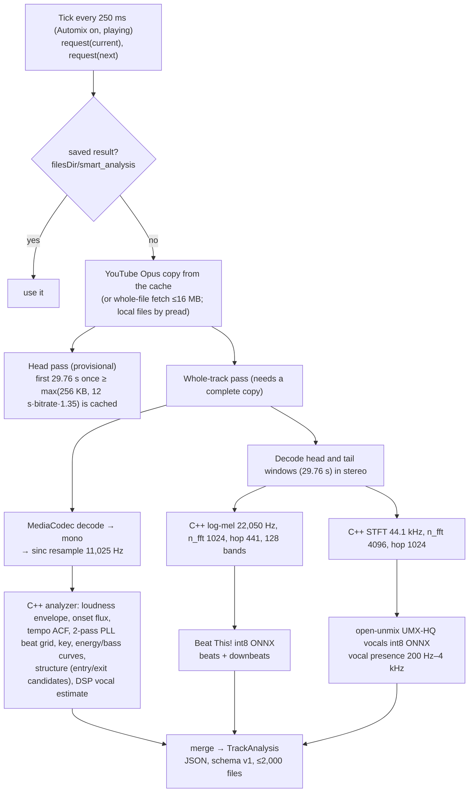
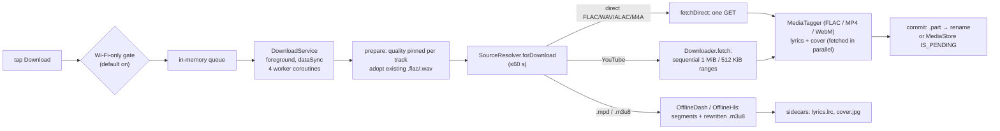

# The BitChord Audio Engine: Architecture, Pipeline and Performance

### A technical study of how a hybrid streaming client resolves, fetches, decodes and plays lossless audio from YouTube Music, JioSaavn and pluggable sources on Android

| | |
|---|---|
| **Subject** | BitChord v1.7 (`versionCode 22`), Android, Kotlin + C++ |
| **Code snapshot** | commit `fe198ac` (`versionName "1.7"`) |
| **Stack** | Media3 ExoPlayer 1.11.0 · OkHttp · InnerTubeX 0.7.0 · NewPipeExtractor 0.26.3 (Rhino) · QuickJS · ONNX Runtime 1.28 · native C++ analyzer |
| **Platform targets** | `minSdk 26`, `targetSdk 36`, `compileSdk 37`; ABIs `armeabi-v7a`, `arm64-v8a`, `x86_64` |
| **Date of study** | 26 September 2026 |
| **Purpose** | A reference for comparing other music-app engines against this one, stage by stage |

---

## Abstract

BitChord is an Android music client. It fronts YouTube Music's catalogue and quietly swaps in higher-quality audio from other catalogues: JioSaavn at up to 320 kbps AAC, and user-configured "addon" or JavaScript "module" servers that can return FLAC, ALAC or Dolby Atmos. Its playback feels much faster than comparable clients, and this paper argues that almost none of that speed comes from the decoder. The decoders are stock Android `MediaCodec` instances. There is no FFmpeg, no libFLAC and no hardware offload. The speed comes from how the pipeline is arranged around the decoder:

1. **Late binding through virtual URIs.** A queue item is not a URL. It is an identity: `bitchord://watch?v=<id>` or `bitchord://source?s=<source>&t=<track>`. The real stream URL is resolved inside ExoPlayer's `ResolvingDataSource` at open time. Because the disk cache sits *outside* the resolver and is keyed on that identity, a cached track never touches the network, not even to resolve a URL.
2. **Racing instead of queueing.** The lossless lookup and the YouTube fallback start at the same instant, and the first acceptable answer plays. The loser is not killed. A still-running lossless lookup is handed to an upgrade path that can swap the better stream in mid-song, after a silent second player has pre-buffered it.
3. **Defeating CDN pacing.** googlevideo paces a single open-ended GET to about 15 kB/s but serves bounded `Range` reads at about 5.7 MB/s. A custom `DataSource` splits every YouTube read into 1 MiB (or 512 KiB) ranges.
4. **Aggressive but bounded buffering.** Playback starts after 500 ms of buffered audio, and resumes after 2 s following a stall. The next track is written to disk in the background, and several resolution caches (5 to 20 minutes) plus single-flight request coalescing keep repeated work at zero.
5. **A float-domain output stage.** A custom `ForwardingAudioSink` converts every PCM format to Float32 and runs its own DSP (a TPT state-variable-filter EQ, spatializer and DJ transition filters). It then hands float, or 16-bit, PCM to the stock `DefaultAudioSink`. When the route supports float, this keeps 24-bit sources bit-exact.

The study also documents where the engine falls short of its own claims. Output defaults to 16-bit, so 24-bit sources are truncated in the decoder unless the user opts in. There is no Android 14 bit-perfect USB path (`setPreferredMixerAttributes`), and the "direct USB" code is a stub. The study also found a verified cache-key bug that effectively disables next-track read-ahead whenever any source is ranked above YouTube, along with several latency sinks: a blocking resolver capped at 120 s, sequential client walks, and a probe round trip. Section 14 is a scorecard for measuring another engine against this one.

---

## Table of contents

1. [Introduction and methodology](#1-introduction-and-methodology)
2. [System overview](#2-system-overview)
3. [Stage 1: sources (where audio comes from)](#3-stage-1-sources)
4. [Stage 2: resolution and orchestration](#4-stage-2-resolution-and-orchestration)
5. [Stage 3: transport, cache and buffering](#5-stage-3-transport-cache-and-buffering)
6. [Stage 4: decoding](#6-stage-4-decoding)
7. [Stage 5: PCM, DSP and output](#7-stage-5-pcm-dsp-and-output)
8. [Stage 6: gapless, crossfade and Automix](#8-stage-6-gapless-crossfade-and-automix)
9. [Stage 7: downloads](#9-stage-7-downloads)
10. [Why BitChord feels fast](#10-why-bitchord-feels-fast)
11. [Quality audit: where "lossless" is and isn't lossless](#11-quality-audit)
12. [Defects and weaknesses found](#12-defects-and-weaknesses-found)
13. [Design principles worth copying](#13-design-principles-worth-copying)
14. [Comparison framework and scorecard](#14-comparison-framework-and-scorecard)
- [Appendix A: tunable constants](#appendix-a-tunable-constants)
- [Appendix B: file map](#appendix-b-file-map)
- [Appendix C: glossary](#appendix-c-glossary)

---

## 1. Introduction and methodology

### 1.1 Why this study exists

Several earlier clients built on the same public sources (YouTube Music's InnerTube API and JioSaavn's web API) were slow to start, slow to skip, and delivered noticeably worse audio. BitChord pulls from the same sources and does not have these problems. The goal is to find out exactly why, at the level of code, constants and ordering decisions, so the findings can be carried over to another engine.

### 1.2 Method

- The full playback, source, download and audio packages were read. That is roughly 37,000 lines of Kotlin under `app/src/main/java/com/music/bitchord/`, plus the C++ in `native/analyzer/` and `app/src/main/cpp/`.
- The work was split into six independent deep reads: sources, YouTube extraction, the ExoPlayer engine, audio output/DSP, Automix and downloads. For the YouTube path, the `InnerTubeX` v0.7.0 library source was read as well, because BitChord delegates client selection and deciphering to it.
- Claims that are surprising or load-bearing were then re-checked by hand against the source. In the text these are marked **(verified)**.

### 1.3 Conventions

- Unless stated otherwise, `path/File.kt:123` means `app/src/main/java/com/music/bitchord/path/File.kt`, line 123, at commit `fe198ac`. Line numbers drift as the code changes, so treat them as "look near here".
- **PS** = `playback/PlaybackService.kt` (7,741 lines, the engine's hub).
- **AC** = `playback/AudioCache.kt`.
- **[ITX]** = the external InnerTubeX library (`com.github.MetrolistGroup.innertubex:innertubex-android:v0.7.0`).
- Timings quoted in `code comments` were measured by BitChord's own developers and recorded in the source. They are not new measurements from this study.

### 1.4 How to use this paper

1. Read §2.3 (identity-keyed, late-bound streams) and §10 (why it is fast) first. Most of the engine follows from those two.
2. To compare another engine, fill the scorecard in §14: first the measurements, then the checklist.
3. For every ❌ or ⚠️ in your column, the matching stage section (§3–§9) shows how BitChord does it. §12 lists the places where BitChord itself gets it wrong, so those mistakes are not copied.

---

## 2. System overview

### 2.1 Technology stack

| Layer | Technology | Where |
|---|---|---|
| Player | AndroidX Media3 ExoPlayer **1.11.0** (+ session, okhttp, hls, dash) | `app/build.gradle.kts:286-300` |
| HTTP | One shared OkHttp client for API calls, extraction and media | `data/Http.kt:134-142` |
| YouTube extraction (primary) | **InnerTubeX v0.7.0**: live-benchmarked client catalogue, cipher tiers, PoToken hook | `build.gradle.kts:340`, `data/innertube/InnerTubeXResolver.kt` |
| YouTube extraction (failsafe) | **NewPipeExtractor v0.26.3**, with signature/`n` solved in **Rhino 1.8.1** | `build.gradle.kts:342-361` |
| PoToken | Hidden **WebView** running BotGuard | `data/innertube/potoken/` |
| JS runtime for sources | **QuickJS** (`quickjs-kt-android 1.0.14`) | `data/sources/module/QuickJsExecutor.kt` |
| Beat / vocal ML | **ONNX Runtime 1.28**; models `beat_this_int8.onnx`, `vocals_umxhq_int8.onnx` | `build.gradle.kts:377`, `app/src/main/assets/` |
| Native DSP analysis | C++ `libbitchord_analysis` (`-O3`, no fast-math) | `app/src/main/cpp/`, `native/analyzer/` |
| Network shares | `smbj` 0.15 (SMB2/3), WebDAV | `playback/SmbDataSource.kt`, `data/webdav/` |
| Listen Together | Go WebSocket server (separate service) | `backend/` |

There are **no decoder extensions**: no FFmpeg, libflac or libopus. Every codec is decoded by the platform's `MediaCodec`.

### 2.2 The architecture in one picture



### 2.3 The central idea: identity-keyed, late-bound streams

Most slow clients follow this sequence: resolve a stream URL for the track, put that URL in the queue, then let the player fetch it. The URL goes stale within hours. Every replay resolves again. A cache keyed on URL misses because each resolve mints a new signed URL. Nothing can be prefetched without resolving first.

BitChord inverts this:

1. **The queue holds identities.** A track is `bitchord://watch?v=<videoId>&n=<title>&a=<artist>&d=<duration>&l=<album>&e=<explicit>&m=<isVideo>`. It carries the metadata a cross-catalogue match needs (`data/sources/SourceResolver.kt:125-132`). Source-native tracks are `bitchord://source?s=<configId>&t=<trackId>`.
2. **The cache wraps the resolver.** `CacheDataSource` sees the virtual URI and derives its key from it (`AC:355-404`). On a hit, bytes come straight off disk and the resolver is never called (`AC:17-22`).
3. **The resolver runs at open time**, inside `ResolvingDataSource` (PS:1204-1471). It decides at that moment which catalogue and which rendition to use, and records the decision (`StreamChoice`) so every later open of the same entry uses the same file.
4. **Every rendition gets its own cache key** (`videoId`, `videoId#alt`, `videoId#hifi`, `videoId#hifi-2`, `source|track`). A FLAC header followed by Opus bytes cannot occur.

This single decision is what makes replays instant, prefetch possible, and mid-song quality swaps safe. Most of the other techniques in this paper depend on it.

### 2.4 Life of a play request (cold, lossless source configured)




---

## 3. Stage 1: sources

### 3.1 The source model

Every catalogue implements one interface, `MusicSource` (`data/sources/MusicSource.kt`). Each has a `SourceKind`, which fixes its rank in the resolution walk and its capabilities (`data/sources/SourceKind.kt`):

| Kind | Rank | Can serve lossless | Prefetched speculatively | Notes |
|---|---|---|---|---|
| `ADDON` | 0 | yes | no | User-added HTTP server. Users drag to reorder among rank-0 sources |
| `CUSTOM_MODULE` | 0 | yes | no | User-added JavaScript module run in QuickJS |
| `MODULE` | 1 | yes | no | Legacy. Removed at init (`SourceRegistry.kt:127`) |
| `JIOSAAVN` | 2 | **no** (AAC ≤ 320 kbps) | **yes** (`SourceKind.kt:136`) | Opt-in and off by default (`SourceRegistry.kt:38`) |
| `YOUTUBE` | 3 | no (Opus ~160 kbps / AAC) | n/a | Seeded on first run, cannot be deleted. The only source for home feed, radio and related tracks |

**Important finding (verified).** BitChord does not ship a lossless backend. No addon or module server URL is bundled. The lossless tier exists only when the user configures an `ADDON` or `CUSTOM_MODULE` endpoint. According to code comments, those endpoints front services such as Tidal (FLAC, Hi-Res over DASH, Atmos as E-AC-3 JOC), Qobuz, Deezer and SoundCloud. JioSaavn is at most 320 kbps AAC, and YouTube Music at most ~160 kbps Opus (itag 251) or AAC 128/256.

**Request tiers.** `SourceResolver.requestForNow()` (`SourceResolver.kt:54-70`) maps the effective quality setting to one of three tiers:
- `Lossless`, when the ceiling is LOSSLESS.
- `Best`, when uncapped.
- `Capped(kbps)` otherwise.

The effective setting depends on the network. `AppSettings.effectiveAudioQuality` picks the Wi-Fi or the cellular preference from `meteredConnection` (`data/settings/AppSettings.kt:762-767`). The quality rungs are (`AppSettings.kt:37-41`):

| Setting | Cap | Meaning in the UI |
|---|---|---|
| LOW | 64 kbps | smallest |
| MEDIUM | none | best YouTube (~171 kbps Opus) |
| HIGH | none | "JioSaavn up to 320 kbps, YouTube fallback" |
| LOSSLESS | none | "Your addons + JioSaavn, bit-exact where available" |

HIGH and LOSSLESS have no bitrate cap. What they change is *which other sources are consulted first*.

**Format descriptor.** `StreamFormat` (`MusicSource.kt:126-161`) carries the codec, kbps, sample rate and bit depth. The codecs treated as lossless are `flac, alac, wav, aiff, ape, wv, dsf, dff`. Atmos is `eac3-joc`. When two streams are compared (`isBetter`, `SourceResolver.kt:1042-1057`), the order is **Atmos > lossless > higher kbps**.

### 3.2 YouTube Music extraction

This is the path that most slow clients get wrong. BitChord uses two stacks, one behind the other.



#### 3.2.1 Primary: InnerTubeX

BitChord never names a playback client itself. It asks InnerTubeX for a progressive, bounded-range audio URL, with HLS and SABR disabled: `ContentHints().withStreamCapabilities(allowHls=false, allowSabr=false, allowBoundedRange=true)`, plus a set of excluded clients (`InnerTubeXResolver.kt:218-228`). It then asserts that no SABR bootstrap came back (`:229`).

**Client catalogue and scoring** ([ITX] `PlaybackClientCatalog.kt`, `ContentAwareFallbackStrategy.kt:60-117, 215-312`):

| Base priority | Clients |
|---|---|
| 100 | VISIONOS (1.02), VISIONOS_0_1 |
| 82 | ANDROID_VR 1.43.32 |
| 75 | TVHTML5 7.20260707 |
| 70 | WEB_REMIX 1.20260707.12.00, TVHTML5_DOWNGRADED |
| 65 | WEB_EMBEDDED_PLAYER |
| 64 / 60 | ANDROID_VR 1.61.48, ANDROID_VR_NO_AUTH |
| 55 | WEB_CREATOR |
| 48 | WEB_SAFARI |
| 42 | TVHTML5_SIMPLY |
| 40 | ANDROID_VR 1.65.10, ANDROID 21.26.364 |
| 38 | MWEB |
| 35 | IOS 21.26.4 |

The base priority is then adjusted:
- signed-in +18, signed-out −18;
- direct fast path (no cipher needed) +10;
- each required PoToken −12;
- a possible `n`-transform −4;
- a possible cipher −3;
- WebView token minting −8;
- lifecycle penalties (canary, deprecated, broken);
- a live health score from `ClientHealthMonitor`.

In practice, clients that return **unciphered, token-free URLs** (VISIONOS, ANDROID_VR) are tried first. For those, cipher work is skipped entirely.

**Pass order** ([ITX] `InnerTubeExtractor.kt:367-512`):
1. **No-cipher direct pass.** No watch-page fetch and no player JS. This is the fast path.
2. **Watch-config pass** with cipher processing. The player config is cached for 30 minutes. Signed-out is tried first, then an authenticated retry if a cookie exists.
3. Embedded-player fallback.
4. WEB_KIDS fallback.

The walk is **sequential, not raced**: an 8 s timeout per `player` POST, a request budget of `4 × catalogue size + 2`, and a stop at the first playback-ready direct audio URL. The library chooses fewer requests and less bot-flag risk over parallel speed.

**BitChord's outer loop** (`StreamResolver.kt:491-515`) makes up to `INNERTUBEX_ATTEMPTS = 3` calls into InnerTubeX:
- A client whose URL fails the probe is added to `skip` and InnerTubeX is asked again.
- A client that is refused *during playback* is excluded for that track for 10 minutes (`InnerTubeXResolver.kt:254-265`).

#### 3.2.2 PoToken (BotGuard) generation

`data/innertube/potoken/`:

- **How a token is minted:**
  - A hidden `WebView` with `blockNetworkLoads=true` loads `assets/po_token.html` under the base URL `https://www.youtube.com` (`PoTokenWebView.kt:73-80, 146-158`).
  - Kotlin fetches the BotGuard challenge from `…/api/jnn/v1/Create` over the shared OkHttp client. JS runs BotGuard, `GenerateIT` returns an integrity token and its TTL, and a minter produces tokens per identifier (`:165-312`).
- **Two tokens:**
  - The *visitorData-bound* token is the `playerRequestToken`. It is cached with the WebView.
  - The *videoId-bound* token is the `streamingDataToken`, appended as `&pot=`. It is minted fresh per call.
- **Lifetime and timeouts:**
  - The token expires at its integrity TTL minus 10 minutes (`PoTokenWebView.kt:219`).
  - One WebView is kept per visitorData session.
  - Timeouts: init 45 s, generate 15 s, outer 8 s. If the outer timeout fires, extraction continues without a token.
  - A WebView that fails once is recreated once. A WebView that keeps failing disables PoTokens for the process (`PoTokenGenerator.kt:47-50, 80, 88-156`).
- **Warm-up:** 2 s after start, `extractor.prewarm()` fetches the player config, preloads player JS and mints a token (`InnerTubeXResolver.kt:65-96`).
- **Which clients need it:**
  - WEB_REMIX and WEB_CREATOR need a video-bound token.
  - TVHTML5_SIMPLY needs a session-bound token.
  - VISIONOS, ANDROID_VR and iOS need none. This is another reason those clients rank first.

#### 3.2.3 Signature cipher and `n`-parameter throttling

A URL with an unsolved `n` parameter is throttled to a crawl. That is one common reason other clients are slow.

InnerTubeX (`YouTubeCipherService`) solves the cipher in tiers:
1. **Pre-computed player configs** ("zemer") fetched from a GitHub-hosted JSON file.
   - Persisted in SharedPreferences with an ETag (`InnerTubeXResolver.kt:162-178, 281-282`).
   - Refreshed after a stream rejection, with a cooldown.
2. The **yt-dlp EJS solver executed in QuickJS**.
3. A regex `PlayerScriptParser` as a last resort.

BitChord adds a **disk cache of EJS-preprocessed player scripts**, keeping the newest 3 in `filesDir/innertubex_players` (`InnerTubeXResolver.kt:98-119`). The comment records a cold solve at 8.7 s in QuickJS.

Two further savings:
- Only the single chosen audio format is deciphered, not the whole format list.
- On the direct fast path the cipher is skipped entirely.

#### 3.2.4 Failsafe: NewPipeExtractor

NewPipe runs only if InnerTubeX returns nothing (`StreamResolver.kt:422-477`).

- **Pinned version.** v0.26.3 is pinned because v0.26.4 fails with "Could not parse deobfuscation function" on the current player build. The library's `Utils.class` is stripped from the jar and replaced with a patched copy (`build.gradle.kts:228-257`).
- **Two optimisations are recorded in comments:**
  - It calls `StreamExtractor.fetchPage()` and reads only `audioStreams`, instead of `StreamInfo.getInfo`. That avoids `n`-transforming about 25 video formats: **49.8 s → 2.3 s** (`StreamResolver.kt:849-869`).
  - NewPipe's `/next` request is short-circuited with a fake 200 response, avoiding a hang of 7 s or more (`:67-100`).
- **Serialisation.** Extractions pass through a single `extractionGate`, because concurrent Rhino work collapsed from **1.8 s to 30 s** (`:971-996`).
- **Dedicated HTTP client.** NewPipe gets its own OkHttp client: pool of 4 connections, 30 s keep-alive, **5 s HTTP/2 ping**, 5 s call timeout. This kills stale sockets quickly (`:214-248`).

#### 3.2.5 Format selection, loudness, expiry

- **Formats** ([ITX] `FormatSelectors.kt:5-67`):
  - `AUTO` picks the best `audio/webm`, favouring Opus. That means itag 251 (~160 kbps), or 774 when offered.
  - `LOW` picks the cheapest `audio/mp4` (139, else 140).
  - `MP4` picks the best AAC (140/141).
- **Mapping in BitChord** (`InnerTubeXResolver.kt:222-226`):
  - Exporting downloads → MP4.
  - `maxKbps ≤ 64` → LOW.
  - Everything else → AUTO.
- **Loudness.** `audioConfig.loudnessDb` from the player response is kept per video. It drives a platform `LoudnessEnhancer` (§7.3).
- **Probe before trust** (`StreamResolver.kt:768-820`). Every new URL gets a `Range` read starting **at 1 MiB**, past the point where a bad URL starts returning 403. The probe requires `Content-Type: audio/*` and 16 KiB actually read, with a 6 s call timeout. Only URLs that have served bytes are cached.
- **Expiry.**
  - The `expire=` parameter is ignored. URLs are cached for 20 minutes, because a URL is bound to the session that minted it (`StreamResolver.kt:1071-1096`).
  - When a 403, 404 or 410 arrives during playback, `onPlaybackRefused` evicts the URL, retires the client that minted it, and refreshes the cipher config (`:833-845`).
- **Per-client headers.** Every media request carries the User-Agent and headers of the client that minted the URL (`StreamResolver.mediaHeadersFor`, `:512`; mapped from the URL's `c=`/`cver=` in `PlayerClient.kt:120-137`). A mismatch is a common cause of 403s in other clients.

#### 3.2.6 Other YouTube plumbing

- **One shared OkHttp client** carries InnerTube, InnerTubeX, the probe *and* ExoPlayer's media reads. Because of that, DNS and the IPv4/IPv6 choice always match the request that minted the URL. The comment in `data/Http.kt:17-39` records that a mismatch caused googlevideo 403s.
- **visitorData** is minted proactively from `www.youtube.com/sw.js_data`. A session-bound value outranks an anonymous one (`Innertube.kt:118-190`).
- **`PlaybackTracker`** (signed-in only) replays the official ping sequence so plays land in YouTube history: `videostatsPlaybackUrl`, then `atrUrl`, then `watchtime` every 30 s plus `final=1` (`PlaybackTracker.kt`). It makes a separate WEB_REMIX `player` call to obtain the tracking URLs.

### 3.3 JioSaavn

File: `data/jiosaavn/JioSaavnService.kt`, adapted by `data/sources/JioSaavnSource.kt`.

| Aspect | Implementation |
|---|---|
| Endpoint | `https://www.jiosaavn.com/api.php`, stored Base64-obfuscated (`:122`) |
| Search | `__call=search.getResults&_format=json&_marker=0&api_version=4&ctx=android&q=…&p=1&n=10` (`:185-207`) |
| Stream | `__call=song.getDetails&pids=<id>`. Handles both the `{"songs":[…]}` and `{"<id>":{…}}` response shapes (`:209-245`) |
| Geo / explicit | Desktop Chrome UA; `X-Forwarded-For` and `X-Real-IP: 49.36.0.1` (an Indian Jio address); `Accept-Language: en-IN`; `Cookie: explicit_content=1` (`:139-147`). Explicit rows are sorted first |
| URL decryption | `more_info.encrypted_media_url` → Base64 decode → **DES/ECB/PKCS5Padding** with the static 8-byte key `38346591` → trim (`:152-166`) |
| Bitrate | Regex `_(48\|96\|160\|320)\.(mp4\|aac\|mp3)(?=[?#]\|$)`. Rewritten to `_320` **only if** `more_info["320kbps"] == "true"`. Otherwise the stated rendition is kept (`:66-84`) |
| Floor | Streams ≤ 96 kbps are refused so the resolver moves on to the next source (`JioSaavnSource.kt:81-87`) |
| Timeouts | 4 s connect, 6 s request (`:134-138`) |
| Match safety | When rows conflict on album and the target has no album, the match is refused unless one row is uniquely "most credited" (`SourceResolver.kt:869-886`) |

**Observed inefficiencies (verified):**
- Search results already include `encrypted_media_url` and the 320 kbps flag, yet `stream()` issues a second `song.getDetails` call.
- Nothing from JioSaavn is cached.
- Search asks for `n=10` results, while the resolver would consider 15 candidates.

### 3.4 Module sources (JavaScript in QuickJS)

Modules are JavaScript files described by a JSON **index**. The index's `category:*` keys hold arrays of `{id, name, download, tags}` (`module/ModuleIndex.kt`, `SpineModule.kt`).

**Loading** (`ModuleManager.loadModule`, `:170-236`; `QuickJsExecutor.newEngine`, `:154-196`):
1. The JS is downloaded over the shared client.
2. A QuickJS engine is created with `console` and an async `__spine.fetch` bridge, plus polyfills (AbortController, `Promise.any/allSettled`, `atob`, `URL`).
3. ES `export`s are stripped and the code is wrapped in a CommonJS IIFE.
4. The module must export `searchTracks` or `getTrackStreamUrl`.

**Pooling.**
- Up to **12 modules** stay resident (LRU), each with **up to 3 engines**, grown lazily (`:71-83`).
- Engines persist between calls, so module-level state such as auth tokens survives.
- Promises are resolved by parking the result in `__spine_resolved_json` and reading it back with a second `evaluate` (`QuickJsExecutor.kt:272-291`).

**The module contract** (`ModuleResults.kt`, `ModuleManager.kt:290-361`):

```js
// search
searchTracks("<query>", limit, { settings: {...} })
  → { tracks: [{ id, title, artist, album, albumCover, duration,
                 audioQuality, format, availableQualities }], total }

// stream
getTrackStreamUrl("<id>", "LOSSLESS" | "HIGH" | "LOW",
  { settings: { quality: {value}, fallbackMode: {value: "strict"|"flexible"},
                dolbyAtmos: {value} } })
  → { streamUrl, track: { audioQuality, mimeType, bitDepth, sampleRate,
                          bitrate, audioModes } }
```

- **Strict mode.** For a Lossless request BitChord sends `fallbackMode=strict`, so the module fails fast rather than walking its own chain (Qobuz → HiFi → SoundCloud → MP3) (`ModuleSource.kt:356-373`).
- **Search budget.** All modules are searched in parallel and the results are interleaved round-robin. The fan-out waits **up to 8 s for the first useful answer**, then gives the stragglers **2.5 s more**. The "patient" variant used for upgrades and downloads waits up to 8 s for the first answer, then gives the stragglers 8 s more, with 25 s overall (`ModuleSource.kt:100-155, 571-593`).
- **Lossless detection is heuristic** (`ModuleSource.kt:200-205, 307-342`), in this order:
  1. MIME type.
  2. An Atmos label (`ATMOS`, `EAC3_JOC`, `EC-3`) → `eac3-joc`.
  3. A lossless label (`LOSSLESS`, `FLAC`, `ALAC`, `HI-RES`, `24-BIT`) → `flac`.
  4. The URL extension.
- **Tidal quirk.** Tidal FLAC arrives as FLAC-in-MP4, so the true sample rate is read from the `dfLa` STREAMINFO box.
- **URL sanity check.** Malformed URLs are rejected before any request, including a known Tidal bug that repeats the origin (`:460-472`).

### 3.5 Addon sources (plain HTTP/JSON)

The protocol is deliberately small (`addon/AddonClient.kt`, `AddonModels.kt`):

| Call | Purpose |
|---|---|
| `GET {base}/manifest.json` | `id, name, version, resources, settings[]`. Optional; `probeSearch` is the fallback check |
| `GET {base}/search?q=…&<settings>` | Track rows |
| `GET {base}/stream/{id}?<settings>` | `AddonStream`: `url`, `codec/fileCodec`, `container`, `manifest/mediaType` (`hls`/`dash`), `encrypted`, `sampleRate`, `bitDepth`, `bitrate` (values over 3000 are treated as bps), `error` |

Behaviour:
- The requested quality tier is mapped onto the manifest's options by keyword (`matchTier`, `:262-272`). `atmos=auto` is sent when the device and the user allow it.
- Encrypted streams are refused.
- Codec precedence is stated codec → container → MIME → Atmos hint → lossless label → URL extension (`AddonSource.kt:320-347`).
- **Errors.** A 404 is treated as a miss. A 429 honours `Retry-After`, or exponential back-off from 0.5 s capped at 8 s with 2 retries, applied per instance so sibling calls also back off. A 5xx marks the addon unavailable.
- **Timeout.** Each call has a 20 s call timeout (`AddonClient.kt:498-502`).

### 3.6 Cross-catalogue matching (`TrackMatcher`)

The hard part of "YouTube track → lossless file" is recognising the *same recording* in another catalogue. BitChord uses **no ISRC** (`AddonModels.kt:25` explicitly ignores it). It relies on text and duration heuristics (`data/sources/TrackMatcher.kt`).

- **Queries** (`:81-87`): `"<clean title> <primary artist>"`, then `"<clean title>"` as a second query, for catalogues that credit the composer or the film.
- **Title parsing** (`parseTitle`, `:332-390`):
  - Splits off bracketed asides and `- …` / `| …` tails.
  - Detects an `Artist - Title` head.
  - Removes `feat.` credits and trailing "official / audio / song".
  - Classifies what remains into:
    - `core`, which must match;
    - `versions` (remix, live, acoustic, slowed, sped up, instrumental, edit, mix, part…), which must match *in both directions*;
    - `context`, which is a tie-break only.
  - "Album Version" and "Radio Edit" are neutral.
- **Scoring** (`:189-244`, weights at `:562-607`):

| Signal | Effect |
|---|---|
| Base | 100 |
| Artist exact / shared / none | +25 / +10 / **reject**. Exception: runtime within 2 s gives −30 instead of a reject |
| Duration Δ ≤ 3 s / ≤ 30 s / > 30 s | +40 / +15 / **reject** (the window widens to 90 s with a shared artist, to absorb music-video intros) |
| Album exact | +35 |
| Explicit flag matches / mismatches | +20 / **reject** |
| Shared context words | +20 |

- **Extra thresholds applied by the resolver:**
  - Prefer candidates within ±3 s (`SAME_RECORDING_SEC`).
  - Upgrades and downloads require ±2 s (`UPGRADE_DRIFT_SEC`) and a shared artist.
  - A mid-song upgrade is checked against the **decoder-reported** duration, not the catalogue value.

---

## 4. Stage 2: resolution and orchestration

### 4.1 Where resolution runs

Resolution happens inside ExoPlayer's `ResolvingDataSource`, when the data source is opened (PS:1204-1471). The resolver runs on Media3's **loader thread**. It calls `runBlocking` inside `withTimeout(RESOLVE_TIMEOUT_MS = 120 s)` (PS:7534). Every URL it returns is recorded in `StreamContainer.served` (PS:1479-1494), so that a later parse failure can be diagnosed as "this was really a manifest".

### 4.2 The resolver's decision ladder

The branches below are checked top to bottom; the first that applies decides.

| # | Condition | Action | Ref |
|---|---|---|---|
| 1 | URI authority is `source` (a track queued from an addon or JioSaavn) | `SourceResolver.resolve(uri)`. On a Lossless request that the pinned source cannot meet, first walk the lossless-capable sources ranked above it **sequentially**, then try the pinned source, then run `bestAcross` over all the others. `direct_youtube=1` goes to `youtubeFallback` instead | PS:1219-1258; `SourceResolver.kt:139-188` |
| 2 | `direct_youtube=1` on a watch URI (the user reverted to the original) | Plain YouTube | PS:1264-1283 |
| 3 | Automix analysis request | Force YouTube Opus | PS:1287-1304 |
| 4 | `q=hifi*` marker | Return the stream parked by `QualityUpgrade`, with no re-resolve | PS:1310-1343 |
| 5 | A `StreamChoice` pin exists for this id (15 min TTL) | Reuse it, so a half-filled cache entry is never finished from a different file. A pin to a lossy substitute is flagged `settledForLess` | PS:1355-1405 |
| 6 | No source ranks above YouTube | `StreamResolver.resolve` | PS:1411-1434 |
| 7 | Otherwise | **`resolveWithModulePriority`: the race** | PS:4468-4602 |

### 4.3 The race

This is the most important latency decision in the engine:

```kotlin
// PS:4489-4505, simplified
val lookup   = async { withTimeoutOrNull(SUBSTITUTE_TIMEOUT_MS /*20 s*/) {
                   SourceResolver.substituteForYouTube(target) } }
val fallback = async { StreamResolver.resolve(videoId) }   // starts at the same instant
val first = select {
    lookup.onAwait   { it }
    fallback.onAwait { it }
}
```

Outcomes:

- **Source wins with a direct file that meets the request.** It plays, with no seam.
- **Source wins with something below the request** (for example 320 kbps when lossless was asked). It plays, and the track is marked `settledForLess` so an upgrade can follow.
- **Source wins with a DASH/HLS manifest.** Playback still **starts on YouTube**, because the progressive media source has already been built. The manifest is handed to `QualityUpgrade` as an already-completed lookup, and the swap declares the MIME type (PS:4534-4575).
- **YouTube wins, which is common.** The lookup is **not cancelled**. It is handed to `QualityUpgrade.settledForLess(inFlight = lookup)` with YouTube's bitrate as the floor (PS:4592-4602).

Whichever stream wins is pinned with `StreamChoice.remember(videoId, stream, substituted)` (PS:1448, 1465).

The comment in `AC:~575` explains why this works: warming YouTube's URL cache ahead of time is what makes the race worth running. With a warm URL, the fallback leg answers in milliseconds, so the listener never waits on a slow module. Without it, the fallback leg costs a full client walk, measured at **7.9 s**.

### 4.4 Racing inside the source layer: `bestAcross`

`SourceResolver.bestAcross` (`:764-816`):
- Launches every candidate source with `async`, then loops on `select`.
- On each wake-up it folds in *every* result that has completed, keeping the best by `isBetter`.
- Returns at the first acceptable answer unless `waitForAll` is set. Stragglers are cancelled in `finally`.

Per source, `matchAndStream` (`:839-900`) works like this:

```
for query in TrackMatcher.queries(target)          // ≤ 2, sequential
    rows   = source.search(query, limit = 15)
    ranked = TrackMatcher.ranked(rows) → artist / strict-length filters
    if ranked not empty → break
streamBest(ranked)                                 // ≤ 3 candidates, sequential
    order: same length ±3 s first, then Atmos / LOSSLESS-labelled rows
    accept if it satisfies the request, else keep the best refusal (belowRequest)
```

**`SharedCalls`** (`module/SharedCalls.kt`) sits underneath. It coalesces identical in-flight calls (index, load, search, stream) and runs them in a `SupervisorJob` scope that **outlives the caller**. So when a race loser is cancelled, its HTTP call still finishes and fills the cache for next time. Failures are not cached. Empty results are.

### 4.5 Resolution caches

| Cache | TTL / size | Ref |
|---|---|---|
| YouTube stream URL (`recent`) | 20 min, 32 entries, only URLs that have served bytes | `StreamResolver.kt:1071-1096` |
| YouTube "unplayable" verdict | 10 min, cleared on login | `StreamResolver.kt:331-362` |
| YouTube player config (InnerTubeX) | 30 min | [ITX] |
| Preprocessed player JS | on disk, newest 3 | `InnerTubeXResolver.kt:98-119` |
| `StreamChoice` pin (which stream fills an entry) | 15 min, 32 entries | `StreamChoice.kt:178` |
| Substitute refusal after a failure | 10 min | `StreamChoice.kt:188` |
| Module index / search | 10 min / 10 min | `ModuleManager.kt:395, 407` |
| Module stream URL | 5 min | `ModuleManager.kt:422` |
| Addon manifest+search / stream URL | 10 min / 5 min | `AddonClient.kt:458-471` |
| JioSaavn | **none** | — |
| PoToken | integrity TTL − 10 min | `PoTokenWebView.kt:219` |

### 4.6 Quality upgrade: play fast, then swap to lossless mid-song

`playback/QualityUpgrade.kt` and PS:3534-4100.



**When is a swap worth it?** `SourceResolver.worthSwapping` (`SourceResolver.kt:657-668`):
- Never swap away from Atmos.
- Always swap to lossless or Atmos.
- A lossy candidate needs at least **96 kbps** more than what is playing (`UPGRADE_MIN_GAIN_KBPS`).

**Two generations.** If the first upgrade is lossy (for example JioSaavn 320), a second pass is armed with the new floor, so a slower FLAC can still win. The tags go `q=hifi`, then `q=hifi-2`, and then no further swaps happen (`swapPointFor`, PS:4029-4057).

**The swap itself** (`swapIn`, PS:3808-4027):
1. Abort if fewer than 20 s of the track remain.
2. Park the new stream in `QualityUpgrade.force`. Build the URI with `&q=hifi`, which gives it a new cache key and forces Media3 to rebuild the source.
3. **Audition** (PS:4094+). A second ExoPlayer with `playWhenReady=false` opens the new URI seeked to the current position.
   - It pre-warms the first 1 MiB, where the FLAC seek table and cover art sit.
   - It fills the cache **12 s past the playhead** (40 s / 24 MiB buffer).
   - If the audition fails, nothing audible happens.
4. Wait for any crossfade to finish (polling every 250 ms, capped at 20 s), plus a 5 s grace period.
5. `replaceMediaItem(index, item.setUri(upgradedUri).withResolvedStreamType(url))`, then `seekTo(position)` and `prepare()`.
6. `watchUpgrade` checks that the new duration matches within `UPGRADE_PROVE_MS = 10 s`, and reverts on a mismatch.

**Result.** The swap is **not sample-seamless**. It is a source rebuild, but because the bytes are already on disk it costs about one decoder initialisation rather than a network round trip. If the queue moves on before a proven upgrade can be applied, the upgrade is **shelved** and reused if the track comes back (`QualityUpgrade.shelve`, `QualityUpgrade.kt:153-176`).

### 4.7 Error recovery ladder

`onPlayerError` → `recoverFrom` (PS:2997-3185):

1. **Missing local file.** Stream the track instead (`restreamMissingLocalFile`, PS:3251-3270).
2. **Any "alternative" failed** (source item, substituted id, or `q=hifi*`). Rebuild the item as `direct_youtube=1&q=original`, refuse substitutes for 10 min, refuse upgrades, and discard the cache entry (`fallbackFailedAlternativeToYouTube`; `PlaybackFallback.kt:393-449`). The alternative gets exactly one chance; there is **no refresh-and-retry** of an expired addon URL.
3. **`ERROR_CODE_PARSING_CONTAINER_UNSUPPORTED`** on a URL that `StreamContainer` saw was `.mpd`/`.m3u8`. Replay it as DASH/HLS under a changed virtual URI, so Media3 builds a new source type (`replayAsManifest`, PS:3326-3370).
4. **Otherwise.** Up to `MAX_RECOVERIES = 2` retries, each after `RECOVERY_DELAY_MS = 350 ms`. Each retry forgets the pin, discards the cached bytes, seeks to the same position and calls `prepare()`, which forces a fresh resolve.
5. **Permanent verdict or retries exhausted.** Skip the track (`skipPastUnplayable`).

`PermanentAwareLoadErrorPolicy` (PS:2928-2948) keeps Media3's default retry behaviour, but returns `TIME_UNSET` (no retry) for `PermanentlyUnplayableException`, searching up to 8 levels of wrapped causes. This way a dead track is skipped at once instead of being retried by the loader.

---

## 5. Stage 3: transport, cache and buffering

### 5.1 The DataSource chain

Built at PS:1479-1505. Listed from the outside in:

```
DefaultMediaSourceFactory                                      PS:1504
 └─ AudioCache.playbackFactory                                 AC:436   (file:// and content:// bypass the cache)
     └─ CacheDataSource(SimpleCache, keyFactory,
                        FLAG_IGNORE_CACHE_ON_ERROR)            AC:468-474
         └─ SmbDataSource.RoutingFactory                       PS:1500  (smb:// goes straight to SMB)
             └─ DefaultDataSource.Factory
                 └─ ResolvingDataSource.Factory                PS:1479  (bitchord:// → URL + headers)
                     └─ ChunkedDataSource.Factory              PS:1483  (1 MiB Range reads)
                         └─ OkHttpDataSource.Factory(Http.client)
   .setLoadErrorHandlingPolicy(PermanentAwareLoadErrorPolicy)  PS:1505
```

Two ordering decisions matter:

- **Cache above resolver.** A hit is served without resolving anything.
- **No headers on the factory.** Headers are set per request by the resolver (`mediaHeadersFor`). Setting them on the factory as well made `OkHttpDataSource` send a second `User-Agent` (PS:1474-1478).

### 5.2 Range chunking: the single biggest throughput trick

`playback/ChunkedDataSource.kt`. The comment at `:16-43` records the measurement:

> an unbounded GET against googlevideo is paced to **~15 kB/s**; a bounded range is served at **~5.7 MB/s**.

A 15 kB/s stream is slower than real time for a 160 kbps (20 kB/s) Opus stream. A client that opens one long GET will stall repeatedly no matter how good its decoder is. This is very likely a main cause of the "slow engine" symptoms seen in other apps.

How the chunking works:

- It applies only when the URL carries `clen` (total length), which in practice means googlevideo (`:69-73`). Every other host gets a single pass-through read.
- Range size is `min(STREAM_CHUNK_BYTES = 1 MiB, PlayerClient.rangeBytesFor(url))`. That is **512 KiB** for ANDROID_VR and TVHTML5_SIMPLY URLs and 1 MiB for others (`PlayerClient.kt:147-159`, which mirrors InnerTubeX).
- It uses the HTTP `Range` header, not the `&range=` query parameter.
- A truncated range is reopened up to 3 times (`MAX_EMPTY_RANGES`, `:149-175`).
- A refusal (403/404/410) calls `StreamResolver.onPlaybackRefused`. That evicts the URL and retires the client that minted it (`:130-151`).
- Ranges are **sequential**. There is no parallel range fetching within one track.

### 5.3 HTTP client

`data/Http.kt:134-142`. One `OkHttpClient` for the whole app:

| Setting | Value |
|---|---|
| Connect / read timeout | 20 s / 30 s |
| `retryOnConnectionFailure` | true |
| `Dispatcher.maxRequestsPerHost` | **16** (OkHttp default is 5) |
| `ConnectionPool` | 16 idle connections, 5 min keep-alive |
| Protocols | OkHttp defaults, so HTTP/2 via ALPN. **No QUIC/Cronet** |
| Call timeout / ping interval | none / none (the NewPipe client has a 5 s ping) |
| HTTP cache | none |

Sharing the client means connections, DNS and the IPv4/IPv6 choice are shared between the InnerTube request that mints a URL and the media read that uses it (see §3.2.6).

### 5.4 The disk cache

- **Store.** A Media3 `SimpleCache` in `cacheDir/audio` with a `StandaloneDatabaseProvider` (AC:198-204).
- **Size.** 512 MB by default, configurable up to 10 GB (`AppSettings.kt:1915`). The limit is resized live through the evictor, without reopening the cache (AC:219-227).
- **Evictor** (`playback/DynamicLruCacheEvictor.kt`). This is LRU with one change. Spans that **start within the first 4 MB of a track are protected**, up to 96 MB in total (`:131, :138`). Plain LRU evicted track openings first, which are exactly the bytes needed for instant starts and for Automix analysis.
- **Keys** (AC:355-404, verified):

| Situation | Key |
|---|---|
| Only YouTube can serve the track | `videoId` |
| A higher-ranked source *might* serve it | `videoId#alt` or `videoId#alt-noatmos` (split on the Atmos setting) |
| Quality-upgraded rendition | `videoId#hifi`, `videoId#hifi-2` |
| Source-native track | `source\|track[#tag]` |

- **Why one key per rendition.** The keyFactory comment gives the reason. A shared key once let a 320 kbps AAC be written into the middle of a half-cached WebM. That produced `IllegalStateException: No valid varint length mask found` at the seam, plus 8 s stalls on a cache lock the outgoing reader still held.
- **Write modes.**
  - Playback writes through the cache with `FLAG_IGNORE_CACHE_ON_ERROR`, so a cache failure never fails playback.
  - Read-ahead writes *without* that flag. If read-ahead loses the single-writer lock, it throws instead of silently downloading bytes that go nowhere.
  - Read-ahead first sends a **64 KiB probe** to check that its writes land (AC:1443-1463). Without the probe, a lost race had cost up to 9 MB of wasted downloads.

### 5.5 Read-ahead (next-track prefetch)

`AudioCache.prefetchQueue` (AC:535-640), driven by `PlaybackService.prefetchAround` (PS:4980).

| Step | Behaviour |
|---|---|
| Delay | `PREFETCH_DELAY_MS = 8 s` after a track starts, so read-ahead does not compete with the current track's startup |
| Next track, bytes | The first 1 MiB (`PRELOAD_BYTES`), then the **whole file** in 2 MiB `CacheWriter` ranges. Up to 4 attempts, 5 s apart |
| Tracks after that, URL only | The YouTube URL is resolved for the next id (and the one after it when the next track's bytes are not being fetched), 500 ms apart. `QUEUE_LOOKAHEAD = 1`. Kept small because concurrent NewPipe extraction collapsed from 1.8 s to 30 s |
| With lossless sources configured | First asks the *quick* sources (only JioSaavn is `worthPrefetching`) through `SourceResolver.prefetchSubstitute`, and pins the result in `StreamChoice`. Bytes are fetched **only if a pin succeeded**, so read-ahead and playback agree on which file fills the `#alt` entry |
| Skipped | Downloaded tracks, source-native tracks, tracks pinned to the original YouTube version, and the current track (the player holds its write lock) |

> **Verified defect (see §12, D1).** When any source ranks above YouTube, `canSubstituteForYouTube()` is true. `keyFactory` then writes read-ahead bytes under `videoId#alt…`, but `fetch()` and `cacheWholeOnce()` check completeness against the plain `videoId` key. After the 64 KiB probe the check reads 0 bytes and gives up. `cacheWholeOnce()` also takes its length from YouTube's `clen` via `StreamResolver.contentLength(videoId)`, which triggers a YouTube resolve for a track pinned to another source. **The net effect is that next-track byte prefetch stops at about 64 KiB whenever a lossless or JioSaavn source is active.** Fast starts in that configuration come from the URL and pin caches, not from bytes on disk.

### 5.6 Buffering policy (`LoadControl`)

`farBufferingLoadControl`, PS:5151-5160. Constants are at PS:7497-7518 (verified):

| Parameter | Value | Rationale recorded in code |
|---|---|---|
| `bufferForPlaybackMs` | **500 ms** | Enough to cover decoder start-up. Bytes are usually on disk already |
| `bufferForPlaybackAfterRebufferMs` | **2,000 ms** | A stall means the network is genuinely struggling |
| `minBufferMs` | Media3 default | |
| `maxBufferMs` | **15 min** | "Past any song", so the *byte* target is what actually stops loading |
| `targetBufferBytes` | **8 MiB** | "~6 minutes at 160 kbps: a whole track" |
| Back buffer | 30 s, retained from keyframe | Kept short because it counts against the 8 MiB limit. A larger one caused a stall loop every few seconds |
| Audition player | 40 s / 24 MiB | Used only for the upgrade pre-fill |

Because the cache writes through, **buffering far ahead is also caching**: whatever the player buffers lands on disk. The weakness is that 8 MiB was sized for Opus. It is about 60–70 s of 16/44.1 FLAC and only about 15–20 s of 24/96 FLAC (§12, D4).

---

## 6. Stage 4: decoding

### 6.1 Decoders: platform `MediaCodec`, with one targeted override

BitChord ships **no decoder of its own**. `DefaultRenderersFactory` is subclassed (PS:5172-5270), extension renderer mode is left off, and every format goes through `MediaCodecAudioRenderer`:

| Codec | Decoder | Notes |
|---|---|---|
| Opus (YouTube 251/774) | Platform (`c2.android.opus.decoder`) | WebM container |
| AAC (YouTube 140/141, JioSaavn, addons) | Platform or vendor AAC | MP4 container |
| **FLAC** | **Forced `MediaCodecSelector.PREFER_SOFTWARE`** (so `c2.android.flac.decoder`) | See below |
| ALAC | Platform only, if the device ships one | The app adds nothing, so ALAC plays only where the OS can decode it |
| E-AC-3 JOC (Atmos) | Platform/vendor | Probed by `DeviceCodecs` (`audio/eac3-joc` → `audio/eac3`), cached per process, **defaults to true on error** |

**The Samsung FLAC fix (verified, PS:5186-5206; `AudioOutputPolicy.kt:43-47`).** Samsung's `c2.sec.flac.decoder` (and `OMX.sec.*flac*`) adds a spurious **232.2 ms timestamp jump to every decoded buffer** when Media3 requests float PCM. Timing breaks, and the result sounds like stutter or skipping. BitChord prefers the software FLAC decoder and filters the Samsung ones out entirely. Any engine that plays FLAC on Samsung phones and asks for float output needs this workaround.

`DeviceCodecs` does **no FLAC, ALAC or hi-res capability negotiation**. Every lossless stream is assumed to be decodable.

### 6.2 Media source types and container recovery

- Everything goes through `DefaultMediaSourceFactory` with default extractors. `FLAG_ENABLE_CONSTANT_BITRATE_SEEKING` and other extractor flags are not set.
- `bitchord://` URIs have no file extension, so they are treated as **progressive** by default.
- DASH/HLS is chosen only when the `MediaItem` declares a MIME type. The upgrade path does this with `withResolvedStreamType` (PS:4206).
- **Self-healing.** If a progressive load fails with `ERROR_CODE_PARSING_CONTAINER_UNSUPPORTED`, and `StreamContainer` recorded that the URL actually served an `.mpd` or `.m3u8`, then `replayAsManifest` discards the cache entry and rebuilds the item with the right MIME type, under a changed virtual URI (`manifest_reopen`). The URI change is necessary, because otherwise Media3 updates the progressive source in place (PS:3326-3370; `StreamContainer.kt:260-271`).

### 6.3 Float or 16-bit: how hi-res is carried or lost

The bit depth delivered to the output is set by **one flag**: `setEnableAudioFloatOutput(...)` (PS:5189).

- **Float on.** `PrecisionAudioSink.getFormatSupport` reports `SINK_FORMAT_SUPPORTED_DIRECTLY` for PCM_FLOAT only when a real float `AudioTrack` will open (`PrecisionAudioSink.kt:459-498`). Media3 then asks the decoder for float output (`KEY_PCM_ENCODING = float`). A 24-bit FLAC is decoded to Float32, whose 24-bit mantissa holds every 24-bit sample **exactly**.
- **Float off.** The platform decoder emits **16-bit PCM**. A 24-bit source is truncated *inside the decoder*, with no dither the app can control.

The float decision (`shouldEnableFloatOutput`, PS:5577-5596; `AudioOutputPolicy.kt:31-38`) requires all three of:
1. The user chose `FLOAT_32`. **The default is `PCM_16`** (`AppSettings.kt:297`, verified).
2. The route is **not** the phone speaker. The speaker is always 16-bit, as a guard against distortion from OEM mixers.
3. The device advertises `ENCODING_PCM_FLOAT`, or supports direct float in a probe at a fixed **48 kHz stereo** format.

When a route change flips this decision, both players are rebuilt, carrying over queue, position and play state (PS:5461-5520).

**Sample rate is never converted by the app.** 96, 176.4 and 192 kHz go from the decoder to the DSP chain to the `AudioTrack` unchanged. A recorded fix (PS:5287-5292) addressed an unknown sample rate being guessed as 48 kHz, which had negotiated a 176.4 kHz stream down. Any resampling that does happen is done by Android's mixer (AudioFlinger) when the route runs at a fixed mixer rate (§7.4).

---

## 7. Stage 5: PCM, DSP and output

### 7.1 `PrecisionAudioSink`: DSP moved out of Media3's 16-bit-only path

**The problem.** In Media3's `DefaultAudioSink`, custom `AudioProcessor`s (EQ, Sonic, silence skipping) run only on the **16-bit** branch. Once float output is enabled, all custom DSP silently stops running (comments at `PrecisionAudioSink.kt:18-53`, PS:5217-5229).

**The fix.** `PrecisionAudioSink` is a `ForwardingAudioSink` that wraps a stock `DefaultAudioSink` (`:62-79`, built at PS:5214-5249). It intercepts `configure` and `handleBuffer`:

```
decoder PCM (16 / 24-packed / 32-int / float, ≤ 8 ch)
  → PcmBoundary.decode   → AudioBlock (Float32, 4096 frames)        :297-358, :628
  → DspChain.process     (Spatial → EQ → Transition, in place)      DspChain.kt:59-81
  → PcmBoundary.encode   → float or PCM16, into a reused direct ByteBuffer
  → DefaultAudioSink.handleBuffer → AudioTrack
```

Engineering details worth copying:

- **Allocation-free in steady state.** Direct ByteBuffers are reused.
- **Backpressure.** Output the delegate could not accept is kept and drained on the next call (`:275-285`).
- **Timestamps.** Split sub-blocks get their own advanced timestamps (`advanceTimestamp`, `:340-374`). Reusing one timestamp let Media3's position check drift past 200 ms, which threw `UnexpectedDiscontinuityException`.
- **Fallback.** If configuring the delegate for float throws, it is retried with PCM16 (`:183-211`).
- **Multichannel.** Up to 8 channels are supported. 5.1 E-AC-3 was the motivating case (`:529-535, :635`).

**Output encodings: float or PCM16 only.** `DefaultAudioSink` always inserts `ToFloatPcm` or `ToInt16Pcm`, so a packed 24-bit or 32-bit integer `AudioTrack` cannot be opened through it (`:39-47, :500-522`; PS hard-codes `delegateSupportsPcm24 = false`).

**Exactness accounting** (`publishOutputExactness`, `:578-594`). This holds only when every DSP stage is bypassed:

| Source → track | Exact? | Why |
|---|---|---|
| 16-bit → PCM16 | yes | ×32768 is a power of two, so the round trip is exact |
| 24-bit → float | yes | 24-bit mantissa |
| float → float | yes | |
| 32-bit int → anything | **no** | 8 bits lost |

**No dither.** `PcmBoundary.clamp16FromFloat` is `Math.round` plus a clamp (`PcmBoundary.kt:157-163`). The `AudioBlock` KDoc mentions dithering, but none is implemented.

### 7.2 DSP chain

The order is **Spatial → EQ → Transition filter** (`DspChain.kt:59-81`; rationale at PS:5250-5256). Every stage works in place on Float32, with no clamping between stages. Each stage **bypasses itself with zero cost** when idle:
- Spatial: `!enabled`.
- EQ: `isFlat && isSettled`.
- Transition: `parked`.

The PCM decode and encode still run on every buffer.

**Equalizer** (`EqualizerProcessor.kt`, `EqualizerCurve.kt`):
- **10 slots**:
  - 7 user bands: a 60 Hz low shelf; bells at 150, 400, 1k, 2.5k and 6k; a 14 kHz high shelf. Q = 1, ±12 dB.
  - 3 "tone pad" bands: a 250 Hz shelf, a 1 kHz bell and a 4 kHz shelf.
- **Topology-preserving-transform state-variable filters** (Zavalishin/Simper style), not direct-form biquads. The pre-warp is `g = tan(π·f/fs)` (`:288-350`). TPT SVFs stay stable and quiet under fast coefficient changes, which suits the gliding used here.
- **Coefficient glide** every 64 frames, with Q interpolated in the log domain, so moving a slider produces no zipper noise.
- **Housekeeping:** bands at 0 dB are skipped, denormals are flushed, and frequencies are capped at 0.45·fs, so the EQ also works at 192 kHz.
- **Auto pre-amp.** The summed magnitude response is swept and the whole curve is lowered by its peak, which prevents clipping from boosts (`EqualizerCurve.kt:163+`).

**Spatializer** (`SpatialAudioProcessor.kt:79-121`). Stereo only:
- Mid/side widening (side ×2.5).
- A 15 ms delayed crossfeed at 0.2, low-passed by a one-pole filter.
- ×0.82 make-up gain.

The one-pole coefficient (0.3) does not depend on the sample rate, so the crossfeed gets brighter at 96 or 192 kHz.

**Transition filter** (`TransitionFilterProcessor.kt`). 4th-order Butterworth low-pass and high-pass filters, each built from two cascaded SVFs with Q = 0.541 and 1.307 (`:288-291`). The cutoffs glide in the log domain. This is what produces Automix's DJ-style filter sweeps and bass swaps (§8).

### 7.3 Loudness normalization

This is **not** part of the float DSP chain. A platform `LoudnessEnhancer` is attached to the audio session (PS:5721-5765):
- Gain = −`loudnessDb` (from YouTube's player response), in millibels, clamped to **−15 … +3 dB** (PS:7479-7480).
- There is a 6 s retry for attaching the effect.

Consequences:
- Only YouTube-described tracks are normalized.
- **No ReplayGain** tags are read from FLAC or local files.
- As a platform effect, it has no effect on a true direct or bit-perfect output path.

### 7.4 Output negotiation, and what "bit-perfect" means here

`OutputNegotiator.selectBestOutput` (`OutputNegotiator.kt:185-396`) is a pure function. Its inputs are the route kind, `AudioDeviceInfo` encodings and sample rates, a direct-playback probe, a USB descriptor probe and Bluetooth telemetry. It tries these in order:

1. **Phone speaker (or unknown):** PCM16, always.
2. **USB with a viable userspace probe:** `DIRECT_USB` + float. *Unreachable in practice, see below.*
3. **API 33+ `AudioManager.getDirectPlaybackSupport`:** float direct → 24-bit packed direct (dead code, since the sink cannot open PCM24) → PCM16 direct.
4. **Mixed `AudioTrack`:** advertised float → PCM24 (dead code) → PCM16, with a recorded `FallbackReason`.

The negotiator's answer is only a *preference*. `PrecisionAudioSink.resolveTargetEncoding` reduces it to **float or 16-bit**, and whether a direct `AudioTrack` is used is decided by Android's AudioPolicy, not by the app.

**What is *not* in the engine** (verified by searching the whole codebase):

| Capability | Status |
|---|---|
| `AudioManager.setPreferredMixerAttributes` (Android 14 bit-perfect USB) | **absent** |
| Userspace USB audio driver | **absent**. `UsbDirectManager` only parses descriptors. `requestPermission` is never called. `DefaultDirectAudioOutput` is a no-op (`usb/DirectAudioOutput.kt:61-74`) |
| AAudio / MMAP | deliberately not used (`AAudioEvaluation.kt:55-68`, `IS_INTEGRATED=false`) |
| Compressed offload (`setAudioOffloadPreferences`) | **absent** |
| Custom `AudioTrack` buffer size / performance mode | **absent** (Media3 defaults) |
| Wake lock (`setWakeMode`) | **absent** |

As a result, on a USB DAC the Android mixer resamples to its own rate (usually 48 kHz) and applies volume, unless AudioPolicy happens to pick a direct profile. The code itself assumes `knownSystemMixerRateHz = 48000` for USB (PS:5349, 5452). The "Stats for nerds" panel can still report `DIRECT_USB` and a `PCM24 packed` HAL format, because those values are inferred from probes rather than measured (`AudioOutputStatus.kt:407-418, 474+`).

**Bluetooth.** There is no codec-specific logic. `BluetoothAudioTracker` reads `BluetoothA2dp.getCodecStatus` through reflection, including the LDAC 990/660/330/ABR mode, but only for display (`:251-430`). A2DP routes rarely advertise float, so Bluetooth ends up at PCM16.

### 7.5 Speed and silence skipping

- **Speed:** `setEnableAudioTrackPlaybackParams(… || enableFloatOutput)` (PS:5230). On float routes, speed changes are handled by the `AudioTrack` time-stretcher rather than Sonic. This fixed audio drifting against the position clock.
- **Silence skipping:** `SilenceSkippingAudioProcessor` with the minimum silence raised to **1 s** (Media3 default is 100 ms), so natural pauses are not cut. Like Sonic, it runs only on the 16-bit branch, so both are dropped on float routes.

---

## 8. Stage 6: gapless, crossfade and Automix

The Automix analysis and planning code is ported from **Orchard** (`SFG5453/Orchard`, AGPL-3.0). The C++ analyzer and both model front ends are "adapted almost unchanged" (`native/analyzer/audio_analysis.h:2-6`). The planner merges Orchard's `TransitionPlanner` and `WsolaPlanner` (`playback/smart/TransitionPlanner.kt:2-3`). The ML weights (*Beat This!* and open-unmix) are MIT-licensed.

### 8.1 Two players

`PlaybackService` builds **two complete ExoPlayers** (PS:1509-1520, 2509). They share the media-source factory (and so the cache) and the audio session ID. Each has its own spatial, EQ and transition-filter processors.

- **Crossfade off.** A single player plays the playlist gaplessly in the normal way. The next item starts quickly because read-ahead has usually cached it already. That holds only when no source ranks above YouTube (see D1).
- **Crossfade or Automix on** (`CrossfadeController.kt`):
  1. About **4 s** before the fade (`ARM_LEAD_MS`), the idle player receives a copy of the queue positioned on the incoming track *at its cue point*, via `setMediaItems(items, next, cueMs)`, with the tempo-stretch speed already applied, volume 0 and `playWhenReady=false`, then `prepare()`. Starting at the cue this way needs no seek (`:881-938`).
  2. When the outgoing track reaches the planned start, the fade begins on a 40 ms tick. The media session, audio focus and UI move to the incoming player right away (`adoptPlayer`, PS:2529-2577).
  3. **Gain** follows equal-power sin/cos curves (`CrossfadeController.kt:1536-1541`), applied through `player.volume` every 30 ms. Progress is measured on the *incoming* track's clock (position − cue), so pausing freezes the blend in place (`:1053-1102`).
  4. If the idle player is not ready within **12 s** (`ARM_TIMEOUT_MS`), the transition is abandoned with a 120 ms bail-out ramp.

### 8.2 Analysis pipeline



**Which audio is analysed.** Always the **YouTube Opus copy**, even when playback is using FLAC or JioSaavn (`AutomixAnalysisSource.kt`; `TrackAnalyzer.kt:280-284`). Tracks that do not come from YouTube are first matched to a YouTube song by search. If nothing is cached, `AudioCache.requestAnalysisHead` fetches the whole Opus file in one request, so a single file never mixes two encodings (`AudioCache.kt:958-1067`).

**Threading and cost.**
- All analysis runs on one background executor. In "Efficient" mode it runs at background thread priority. ONNX Runtime uses 1, 2 or 4 threads depending on the performance mode.
- Sessions are released when the queue empties, so the models are reloaded for nearly every burst of analysis.
- The author's own figures: about **7 s per track**, and about 35 MB of full-rate mono plus 8 MB resampled for a 3.5-minute song.
- Results are saved, so each track pays this cost only once.

**DSP algorithms** (`native/analyzer/tempo_analysis.cpp`, `audio_analysis.cpp`):

| Feature | Method |
|---|---|
| Onsets | 512-point Hann FFT, hop 128 (86 frames/s). Positive log-magnitude spectral flux over the full band and below 150 Hz. The local mean is subtracted and the result square-root compressed |
| Tempo | Autocorrelation over 70–200 BPM on at most the first 180 s. Score = r(L) + 0.42·r(2L) + prior (118 BPM). Half- and double-tempo are checked against a log-Gaussian prior (120 BPM, 0.7 octave). Parabolic sub-frame refinement. Beat phase from a comb filter over the first 30 s |
| Beat grid | **Two-pass phase-locked loop**: phase gain 0.2, interval gain 0.01, search window ±¼ beat, interval clamped to ±3%, coasting on weak onsets. Pass 1 learns the tempo, pass 2 lays the grid |
| Downbeats | The bar position with the strongest bass-band onsets plus 0.4 × full-band onsets. All times shifted +23 ms to the window centre |
| Key | 4096-point chroma every 0.65 s (45 Hz–5 kHz). Krumhansl–Kessler major and minor profiles |
| Energy | RMS curve (≤ 240 points), plus a band curve below 250 Hz for choosing the bass-swap point |
| Structure | 4/4 time and 8-bar phrases assumed. Entry candidates are pickup, intro_drop and main_drop. Exit candidates are energy_cliff, outro_start and content_end |

**ML models** (`assets/`, run through ONNX Runtime from Kotlin):
- ***Beat This!*** (int8, 4.5 MB). The front end reproduces torchaudio exactly: periodic Hann window, reflect padding, Slaney mel scale, `log1p(1000·x)`. The model output then goes through peak picking with **parabolic sub-frame refinement**. That refinement is BitChord's own addition, because 20 ms frames are too coarse for beat-matching.
- **open-unmix UMX-HQ vocals** (int8, 9 MB). Input is a fixed 960 frames (22.3 s). Vocal presence per frame is the mean of `clip(vocal / mix)` over 200 Hz–4 kHz.

**Split between C++ and Kotlin.** C++ is used where exact reproduction of the models' preprocessing and hot loops matter: the analyzer, a sinc resampler with a precomputed table, and a sparse mel filterbank. It is compiled with `-O3` and **no `-ffast-math`**. Kotlin handles decoding, ONNX Runtime, peak picking, the transition policy, the planner and playback.

### 8.3 Planning a transition

**Confidence tiers** (`TransitionPolicy.kt:430-466`):

| Tier | Condition | Allowed |
|---|---|---|
| PLAIN_CROSSFADE | BPM outside 40–220, or both beat confidences < 0.2 | An equal-power fade ending at the chosen exit, with the incoming track cued at its audible start |
| BEATMATCHED | Both confidences ≥ 0.55 **and** tempo ratio (octave-folded) within ±4% | Phrase-aligned blends with tempo stretch |
| DJ_ASSISTED | Everything else | Adaptive overlap. The code comment says "no stretch", but see A3 |

A BPM taken from metadata carries confidence 0, so it can never enable beat-matching.

**Guards.**
- Tracks under 45 s get no smart transition.
- Titles or artists matching `podcast|episode|audiobook|live|concert|performance` get no smart transition. This also blocks songs titled "Live …".
- If analysis is missing, a fixed fade of the user's crossfade length is used, or 6 s.

**Exit choice.** Candidates are ranked by score. Any exit that would skip more than **12 s of *audible* music** is dropped; skipped silence does not count.

**Entry choice.** Score = type weight (main_drop 0.5, intro_drop 0.4, …), plus 0.1 if on a downbeat, minus 0.2 for a cold open (less than 4 beats of intro), plus 0.4 × (0.5 − vocal activity over the preceding 16 beats).

**Phrase switch** (BEATMATCHED with compatible keys; `TransitionPlanner.kt:575-785`):
- The incoming track is stretched by BPM_out / BPM_in.
- Overlap is 4–16 beats in whole bars, at most 16 s.
- The overlap **shrinks 4 beats at a time while a vocal clash is detected**. A clash is any of: more than 5% of the overlap with both tracks singing at the same instant; both window averages ≥ 0.6; or sustained vocals deep in the outgoing window.
- The bass-swap beat is where the incoming bass rises most relative to the outgoing bass. The fallback is 70% of the overlap.

**Adaptive overlap** (everything else):
- 8 beats, or 16 when tempo differs by more than 7% or key by more than 4 semitones. Maximum 12 s.
- The start snaps to a phrase boundary within 4 beats, or a downbeat within 2 beats.
- The style is DJ_BLEND if the tempi are within 5%, otherwise DJ_FILTER.
- The incoming track may be stretched by up to ±10%.

### 8.4 Rendering a transition

| Style | Outgoing track | Incoming track |
|---|---|---|
| DJ_FILTER | Low-pass sweeps 7 kHz → 300 Hz | High-pass starts at 1.2 kHz, fully open by 60% of the fade |
| DJ_BLEND | Bass is handed over at the chosen beat (200 Hz cut, over 10% of the fade). Low-pass closes to 2.2 kHz (1.1 kHz if vocals clash) | Bass cut at 200 Hz until the swap. Entry high-pass at 520 Hz (950 Hz if vocals clash) |
| EQUAL_POWER | Low-pass toward 1.6 kHz, scaled by vocal overlap | High-pass at 700 Hz, scaled likewise |

- **Filters:** 4th-order Butterworth low-pass and high-pass filters built from SVFs, in each player's float DSP chain (§7.2). Coefficients are recalculated every 64 samples, with cutoff changes smoothed over about 30 ms.
- **Tempo:** the incoming player's speed is set to user speed × stretch ratio, with pitch preserved (Sonic on 16-bit routes, AudioTrack playback parameters on float routes). The ratio stays **constant** for the whole blend and snaps back to the user's speed at the end.
- **Beat alignment:** comes from the plan only, with **no correction during playback**. The author measured **9–41 ms** of start skew between the two players.

### 8.5 Version swap alignment (`VersionAudioAligner`)

This handles the user swapping the current song to another version of it (music-video cut ↔ album audio ↔ FLAC release) without losing their place:

1. The first 45 s of both versions are decoded in parallel.
2. Each is reduced to an RMS envelope (40 ms windows, 10 ms hop).
3. The offset is found by **FFT-based normalised cross-correlation** over ±40 s, using running sums. At least 3 s of overlap is required.
4. The result is accepted only if the correlation is ≥ 0.40 and the peak is not at the edge of the search range. The difference between the two decoders' first timestamps is added.
5. The idle player is prepared at *position + offset* and started muted. It is then re-seeked, within what it has already buffered, to the *live* position + offset, which cancels its start-up delay.
6. A 550 ms equal-power crossfade completes the swap (PS:1925-1990).

Resolution is 10 ms, and a single constant offset is assumed.

---

## 9. Stage 7: downloads

### 9.1 Pipeline



**Service** (`download/DownloadService.kt`):
- A plain foreground `Service` (`FOREGROUND_SERVICE_TYPE_DATA_SYNC`, `START_NOT_STICKY`), not WorkManager.
- `WORKERS = 4` coroutines pull from an in-memory queue.
- Four workers were chosen because the bottleneck is *lookup latency*, not bandwidth. The module engine pool (3 per module) is also the cap on how many lookups a module can run concurrently.

**Resolution** (`Downloads.prepare`/`routeFor`, `Downloads.kt:868-1136`; `SourceResolver.forDownload`, `:493-627`):
- STANDARD → YouTube.
- LOSSLESS → lossless-capable sources walked in rank order with `waitForAll`. The first bit-exact or Atmos stream wins. A parallel `bestAcross` gathers the best lossy fallback, which is kept only if it beats **256 kbps** (YouTube's best AAC).
- The whole lookup is capped at 60 s. That cap is sized to fit two 25 s "patient" module searches.
- **Shortcut:** if `Artist - Title.flac` or `.wav` already exists in the destination folder, it is adopted before any network lookup.

**Transfer.**
- YouTube: sequential ranges of `min(2 MiB, rangeBytesFor(url))`, so 1 MiB or 512 KiB in practice. This is the same anti-pacing trick used for playback.
  - The length comes from `clen`, or from a `bytes=0-0` probe.
  - On a 403, 404 or 410, the URL is re-resolved **once**, resuming at the current byte offset (`Downloader.kt:64-136`).
- Sources: a single plain GET with the source's own headers (`fetchDirect`, `:166-205`).

**DASH/HLS lossless (for example Tidal Hi-Res) is not remuxed.**
- `MediaMuxer` cannot write FLAC or Dolby into a fresh MP4.
- Instead, the init segment and fMP4 segments are saved one by one, and a local `.m3u8` is written. For DASH, an HLS playlist is synthesised from the `SegmentTemplate` or `SegmentTimeline`.
- Media3's HLS source then plays the package as it is (`OfflineHls.kt`, `OfflineDash.kt`).
- Encrypted and multi-period manifests are refused.
- These packages play only inside BitChord.

**Tagging is hand-written** (`MediaTagger.kt`, one `Mutex` across workers to cap heap use):
- **FLAC** (`FlacTagger.kt`): the metadata block chain is rebuilt with a new `VORBIS_COMMENT` (vendor "BitChord", plus a word-synced lyrics field) and a type-3 `PICTURE`. The audio frames are **streamed** into a temp file rather than loaded into memory (about 120 MB of byte arrays avoided).
- **MP4** (`Mp4Tagger.kt`): a `udta/meta/ilst` atom is appended to `moov`. Every `stco`/`co64` chunk offset past the insertion point is shifted. This is done in memory.
- **WebM** (`WebmTagger.kt`): Matroska `Tags` and `Attachments` are appended, and the Segment size is widened in place when needed.
- **Cover art:** fetched at 1200 px, stored at ≤ 1000 px as JPEG quality 92, and cached by SHA-256 hash.

**Storage.**
- By default files are app-private: `filesDir/downloads/Artist - Title.ext`, written as `.part` and then renamed.
- With export enabled, API 29+ uses MediaStore `Music/BitChord` with `IS_PENDING`.

**Offline playback.** `Song.toMediaItem` prefers a verified local URI, checked with a cheap `stat` (`PlayerConnection.kt:569-570`). A file that has vanished is re-streamed automatically.

### 9.2 Download gaps

- No persistent queue and no resume (`.part` files are deleted when a download restarts).
- No retry or back-off for transient errors, and one bad segment fails a whole HLS package.
- Segments are fetched sequentially.
- **The playback cache is never reused.** A track streamed in full is downloaded again from scratch.
- `FlacTagger` discards the source's own Vorbis comments. TRACKNUMBER, DATE, ISRC and REPLAYGAIN are lost.
- `Downloader.isDirectAudioFile` is a magic-byte probe meant to catch a "FLAC" URL that is really a playlist. It is **dead code** (verified: it is defined and never called).

---

## 10. Why BitChord feels fast

The techniques below are ranked by estimated impact on what a listener notices: time-to-first-audio (TTFA), skip latency and mid-track stalls. "Replicate" describes the minimum another engine needs to copy the benefit.

| # | Technique | Effect | Where | Replicate |
|---|---|---|---|---|
| 1 | **Range-chunked googlevideo reads** | Throughput goes from ~15 kB/s (paced, slower than real time) to ~5.7 MB/s | `ChunkedDataSource.kt` | Wrap your HTTP `DataSource`. When the URL has `clen`, issue sequential `Range: bytes=a-b` reads of ≤ 1 MiB (512 KiB for ANDROID_VR/TV clients) |
| 2 | **Cache keyed on track identity, placed above the resolver** | Replays and back-skips play from disk with zero network and zero resolve | `AudioCache.kt:355-404`, PS:1479-1505 | Queue virtual URIs, use `CacheDataSource(keyFactory = id-based)` *outside* `ResolvingDataSource`, and give every rendition its own key |
| 3 | **Unciphered, token-free clients first** (VISIONOS, ANDROID_VR) | No player-JS download, no cipher solve (a cold solve takes 8.7 s), no PoToken | InnerTubeX catalogue | Prefer clients whose URLs need neither `n` nor a signature. Keep a solver only as a fallback |
| 4 | **Race lossless lookup against YouTube with no head start**; keep the loser | Start latency ≈ the faster of the two; lossless still arrives later | PS:4468-4602 | Two `async`s plus `select`. Hand the unfinished lookup to an upgrade path instead of cancelling it |
| 5 | **Low start thresholds** (500 ms start, 2 s after a stall) | Sound starts as soon as the decoder is fed | PS:5151-5160 | `DefaultLoadControl.Builder().setBufferDurationsMs(min, max, 500, 2000)` |
| 6 | **Warmed URL caches for the next tracks** | The next track's YouTube leg answers in ms, not in a client walk (measured at 7.9 s) | AC:535-640 | Resolve the next 1–2 queue items' URLs in the background, spaced out, and cache them for 20 minutes |
| 7 | **Whole-next-track `CacheWriter` fill** (8 s after start) | Gapless next track even on a bad network (but see D1) | AC:535-716 | `CacheWriter` in 2 MiB ranges, a lock probe, and cancellation wired to the coroutine |
| 8 | **Single-flight + detached `SharedCalls`** | No duplicate walks. Race losers still fill caches | `StreamResolver.kt:386-420`, `SharedCalls.kt` | Coalesce by key in a supervisor scope that outlives the caller |
| 9 | **Probe before cache** (Range @ 1 MiB, 16 KiB) | Only URLs that have really served bytes are cached, so a cached URL does not fail mid-song | `StreamResolver.kt:768-820` | Probe once per new URL (keep it cheap, see D6) |
| 10 | **Per-client headers + one shared client (same DNS and IP family)** | Avoids 403s that force re-resolves | `Http.kt:17-39`, `PlayerClient.kt` | Send the minting client's UA and headers. Never mix IPv4 and IPv6 between mint and fetch |
| 11 | **Persisted cipher configs and preprocessed player JS** | Cold starts skip the 8.7 s solve | `InnerTubeXResolver.kt:98-178` | Cache solver output on disk, keyed by player version |
| 12 | **Start-up pre-warm** (player config, JS, PoToken) 2 s after launch | The first play of a session avoids the cold path | `InnerTubeXResolver.kt:65-96` | Pre-warm off the main thread after the first frame |
| 13 | **Opening-protecting evictor** | Starts stay instant even when the cache is full | `DynamicLruCacheEvictor.kt` | Protect spans in the first 4 MB of each track, up to a budget |
| 14 | **Audition before swap** | A quality upgrade costs about one decoder init, not a network round trip | PS:4094+ | A silent second player pre-fills the upgrade's cache entry past the playhead |
| 15 | **NewPipe fast paths** (`fetchPage` + audio only; fake `/next`; serialized Rhino; 5 s HTTP/2 ping) | 49.8 s → 2.3 s; avoids 7 s hangs; avoids 1.8 s → 30 s contention | `StreamResolver.kt:67-100, 214-248, 849-996` | Apply the same fixes if you use NewPipe |
| 16 | **Many connections per host** (16) and a large pool | Read-ahead, analysis and playback do not queue behind each other | `Http.kt:134-142` | `Dispatcher.maxRequestsPerHost = 16`, `ConnectionPool(16, 5 min)` |

**What does *not* contribute to speed:** the decoder, offload, native code in the playback path, QUIC, or `PreloadManager`. None of these are used. The speed comes from organising the network and caching layers, not from the audio stack.

---

## 11. Quality audit

"Lossless" is a property of every stage, and any single stage can lose it. The table follows a 24-bit/96 kHz FLAC from an addon server through BitChord's defaults, and then with the user's best settings.

| Stage | Default settings | Best case (FLOAT_32 + a float-capable external DAC) |
|---|---|---|
| Source | FLAC 24/96, bit-exact file (if an addon or module is configured) | same |
| Transport and cache | byte-exact (the cache stores the file verbatim) | same |
| Decode | Software FLAC → **16-bit PCM** (truncated in the decoder, no dither) | Software FLAC → **Float32** (exact) |
| Sample rate in app | 96 kHz, untouched | 96 kHz, untouched |
| DSP | Bypassed when flat/off (exact); otherwise float processing, then re-quantised to 16-bit with no dither | Bypassed (exact), or float processing with no re-quantisation |
| Sink → AudioTrack | PCM16 | Float |
| Android mixer (AudioFlinger) | Usually resampled to 48 kHz, plus software volume | Same, unless AudioPolicy picks a direct profile (the app does not request bit-perfect) |
| **Delivered** | **16-bit, usually 48 kHz** | **Float at the mixer rate. Bit-perfect only if AudioPolicy goes direct** |

Quality verdicts by output:

- **Phone speaker:** always 16-bit, by design. The speaker cannot resolve more than 16 bits anyway.
- **Bluetooth:** PCM16 into the A2DP codec (SBC/AAC/aptX/LDAC). The codec is the limit, so no improvement is possible here.
- **Wired / USB DAC:** this is where the engine falls short of its label. To be truly bit-perfect on Android 14+, the engine would need three things:
  1. `AudioManager.setPreferredMixerAttributes(..., AudioMixerAttributes(format with the source's rate and encoding, MIXER_BEHAVIOR_BIT_PERFECT))` on the USB device.
  2. An `AudioTrack` opened at the source's native rate.
  3. Hardware volume. Platform effects and player-volume crossfades are ignored on that path.

  BitChord does none of these.

**Where quality is genuinely protected:**
- Catalogue matching refuses near-misses (±2–3 s, artist and version equality), so the "lossless copy" is the same recording.
- Atmos is never downgraded to stereo lossless.
- The Samsung FLAC timestamp bug is avoided.
- The EQ is well engineered: TPT SVF, coefficient glides, auto pre-amp, and correct at 192 kHz.
- 24-bit survives the chain when float output is on.

---

## 12. Defects and weaknesses found

**Severity:**
- 🔴 correctness or security bug with user-visible impact
- 🟠 significant latency, quality or robustness cost
- 🟡 minor, or cleanup

"Verified" means the finding was re-checked by hand against the source.

### 12.1 Latency and throughput

| ID | Sev | Finding | Evidence | Suggested fix |
|---|---|---|---|---|
| **D1** | 🔴 | **Next-track byte prefetch stops at about 64 KiB whenever any source ranks above YouTube** (verified). Read-ahead writes land under `videoId#alt…`, but `fetch()` and `cacheWholeOnce()` check `getCachedBytes(videoId, …)` on the plain key. `cacheWholeOnce()` also sizes the file from YouTube's `clen`, which costs a YouTube resolve for a track pinned to JioSaavn | AC:1420-1461 (`fetch(videoId,…)` passes the plain id as the check key); AC:693-712 (`cacheWholeOnce`); `keyFactory` AC:355-391; `StreamResolver.kt:1066` | Compute the check key with the same `keyFactory` logic (or pass `pinKey=true` with the `#alt` key). Take the length from the pinned `SourceStream` (Content-Length) instead of `clen` |
| D2 | 🟠 | Resolution **blocks the loader thread** (`runBlocking`) for up to **120 s** | PS:1222-1300 (`runBlocking`), PS:7534 | Resolve asynchronously before `prepare()` (a pre-resolution stage), or cap at ~20 s and fail over |
| D3 | 🟠 | InnerTubeX walks clients **sequentially** with an 8 s timeout per request; worst case is tens of seconds | [ITX] `PlayerClientDirector.kt:190-330` | Race the top 2 clients, or use a hedged request after ~1.5 s |
| D4 | 🟠 | The 8 MiB `targetBufferBytes` was sized for Opus: about 60–70 s of 16/44.1 FLAC and about 15–20 s of 24/96 | PS:7506 | Scale the byte target with the stream's bitrate (for example 90 s × bitrate) |
| D5 | 🟠 | Non-googlevideo streams (module or addon FLAC) are **never range-chunked**, so everything depends on that CDN not pacing one long GET | `ChunkedDataSource.kt:69` | Chunk any host that honours `Range`, measured on first use |
| D6 | 🟡 | The probe asks for 1 MiB but reads 16 KiB, so the HTTP/2 stream is reset and in-flight bytes are wasted. It also adds a serial RTT (≤ 6 s) to every cold resolve | `StreamResolver.kt:768-820` | Request exactly `bytes=1048576-1064959`, or treat the first real range read as the probe |
| D7 | 🟡 | 8 s prefetch delay: a skip within the first 8 s lands on an uncached next track | AC:154 | Prefetch the first 1 MiB immediately and delay only the whole-file fill |
| D8 | 🟡 | A duplicate WEB_REMIX `player` request per track (signed in) just for tracking URLs, plus a separate NewPipe player-JS parse just for `signatureTimestamp` | `PlaybackTracker.kt:241`; `Innertube.kt:688-729` | Reuse `ExtractedStream.playbackTracking` and InnerTubeX's STS |
| D9 | 🟡 | `ContentHints()` is always empty, so InnerTubeX's per-track PoToken prefetch (which overlaps token minting with the client walk) never runs | `InnerTubeXResolver.kt:218-228` | Pass hints (explicit / age-gated) when known |
| D10 | 🟡 | The main OkHttp pool keeps idle sockets 5 min with **no ping interval**. The NewPipe client was fixed for exactly this stale-socket hang | `Http.kt:134-142` | Set `pingInterval(5–10 s)` and a call timeout |
| D11 | 🟡 | The JioSaavn stream call repeats data that search already returned (`encrypted_media_url`, `320kbps`), and nothing is cached | `JioSaavnService.kt:185-245` | Decrypt from the search row and cache the result for 10 min |
| D12 | 🟡 | No `setWakeMode(C.WAKE_MODE_NETWORK)`, so Wi-Fi may sleep during long screen-off streaming (mitigated by the foreground service) | codebase search | `player.setWakeMode(C.WAKE_MODE_NETWORK)` |
| D13 | 🟡 | Media3 `PreloadManager` and `setPreloadConfiguration` are unused. All preloading is hand-rolled around a single-writer cache lock | codebase search | Consider `DefaultPreloadManager` for the next item's first period |

### 12.2 Quality

| ID | Sev | Finding | Suggested fix |
|---|---|---|---|
| Q1 | 🟠 | **Output defaults to `PCM_16`**, so 24-bit lossless is truncated in the decoder unless the user finds the setting (`AppSettings.kt:297`, verified) | Default to float on non-speaker routes that advertise it |
| Q2 | 🟠 | **No Android 14+ bit-perfect USB** (`setPreferredMixerAttributes` absent). The mixer resamples to 48 kHz | Implement `AudioMixerAttributes` with `MIXER_BEHAVIOR_BIT_PERFECT`, then disable effects and player-volume ramps on that path |
| Q3 | 🟠 | The "Direct USB" status and `PCM24 packed` HAL format shown in "Stats for nerds" are **inferred, not measured**. The userspace USB driver is a stub | Report only what `AudioTrack`/`AudioRouting` actually confirm |
| Q4 | 🟡 | No dither when float is re-quantised to 16-bit after DSP | TPDF dither (±1 LSB) in `clamp16FromFloat` whenever DSP is active |
| Q5 | 🟡 | Direct float support is probed only at 48 kHz stereo, and an empty `AudioDeviceInfo.encodings` list is treated as "no float" | Probe at the source's rate. Treat an empty list as "arbitrary" (per the Android docs) |
| Q6 | 🟡 | No ReplayGain. Normalization comes only from YouTube's `loudnessDb`, through a platform effect that does nothing on a direct path | Read the `REPLAYGAIN_*` Vorbis comments and apply gain in the float DSP chain |
| Q7 | 🟡 | DRC variants of Opus formats are not filtered out, so normalization can stack on an already compressed stream | Prefer non-DRC itags |
| Q8 | 🟡 | `YouTubeSource` always labels streams `opus`, even when AAC was chosen | Derive the codec from the URL's `mime=` |
| Q9 | 🟡 | The spatializer's crossfeed low-pass coefficient is fixed, so it gets brighter at high sample rates | Derive the coefficient from `fs` |

### 12.3 Correctness, security and robustness

| ID | Sev | Finding | Suggested fix |
|---|---|---|---|
| S1 | 🔴 | **Unescaped string splicing into JavaScript** (verified). `searchTracks("\"$query\"", …)` and `getTrackStreamUrl("\"$trackId\"", …)` build JS source by hand (`ModuleManager.kt:268, 314`). Title words are stripped to alphanumerics, but the **artist string is only lower-cased** (`TrackMatcher.primaryArtist`). An artist or channel name containing `"` or `\` breaks the call, or runs code inside a module engine that keeps state (for example auth tokens) and has a `fetch` bridge | Encode every argument with a JSON encoder (`Json.encodeToString(query)`) |
| S2 | 🟠 | A failed alternative source gets exactly one chance, and there is no re-resolve of the same source. Fixed 5 min / 15 min TTLs ignore the server's `expiresAt`, so a short-lived signed URL can outlive its pin and push the track to YouTube | Honour `expiresAt`, and re-resolve the same source once before falling back |
| S3 | 🟡 | The `minted` URL→headers map is cleared wholesale at 64 entries while the URL cache keeps URLs for 20 min. After a clear, header lookup falls back to `PlayerClient` defaults, which risks a UA mismatch and a 403 | Store the headers *with* the cached URL |
| S4 | 🟡 | The YouTube URL cache is not keyed by quality ceiling, so a Wi-Fi → cellular change within 20 min reuses the high-bitrate URL. The InnerTubeX pick is not checked against `maxKbps` | Key the cache by `(videoId, ceiling)` |
| S5 | 🟡 | QuickJS `fetchUrlSync` makes a blocking OkHttp `execute()` on `Dispatchers.Default` while holding a VM, through a separate client. It cannot be cancelled, and it returns text only (no `arrayBuffer`, no response headers) | Make it async on the shared client and support binary bodies |
| S6 | 🟡 | Downloads have no resume, no persistent queue, and no retry on transient errors. HLS packages are re-downloaded every time they are queued. The playback cache is never reused | Persist the queue, keep `.part` files with a Range resume, and copy from `SimpleCache` when complete |

### 12.4 Automix

| ID | Sev | Finding | Suggested fix |
|---|---|---|---|
| A1 | 🔴 | **Key names lose their sharps and flats** (verified). The analyzer writes `C♯` and `E♭` in UTF-8 (`audio_analysis.cpp:404-407`), but the JNI JSON writer drops every non-ASCII byte (`analysis_jni.cpp:49-57`). "C♯ minor" becomes "C minor", so 5 of the 12 roots are misread by a semitone in the planner and saved to disk that way | Emit ASCII names (`C#`, `Eb`), or escape UTF-8 properly |
| A2 | 🔴 | **A phrase switch can cut a song about 30 s in.** The start snaps to the latest downbeat at or before the target with no distance limit (`nearestAtOrBefore`, `TransitionPlanner.kt:523-524`, verified), but downbeats exist only in the head and tail windows. If the tail grid is missing, or only the head pass has run, the switch lands near 0:28. This was reproduced by the analysis agent with a small test program | Cap the snap distance (as the adaptive path does), and require a whole-track analysis before a phrase switch |
| A3 | 🟠 | The DJ_ASSISTED tier is documented as "no time-stretch", but the adaptive path stretches up to ±10% (for example rate 0.9375 for 120 vs 128 BPM) | Enforce the tier's rule, or cap at the stated 4% |
| A4 | 🟡 | Key compatibility accepts *parallel* keys (A major / A minor) but rejects *relative* keys (C major / A minor), which is the reverse of Camelot convention (`TransitionPlanner.kt:224-233`) | Treat relative major/minor as distance 0 |
| A5 | 🟡 | No drift correction between the two players (9–41 ms start skew was measured). The fade length is in outgoing seconds while progress runs on the incoming clock, so the fade and bass-swap timing are off by the stretch ratio | Re-align phase once after start. Convert fade timing through the stretch ratio |
| A6 | 🟡 | The shared `LoudnessEnhancer` switches to the incoming track's gain as soon as the fade starts, so the outgoing tail plays at the wrong gain. The per-track hook `onArmIncoming` is never connected | Apply per-player gain in each player's float DSP chain |
| A7 | 🟡 | Analysis always uses the YouTube Opus copy (up to 16 MB extra download) even when playback is lossless. Head and tail are decoded twice. The vocal model never sees the last ~7.5 s of a track. The analysis file does not store the track id (hash + length only) | Analyse the rendition that is playing, decode once, and store the id |

---

## 13. Design principles worth copying

1. **Queue identities, not URLs.** Resolve at open time and cache by identity. Everything else builds on this: instant replays, safe prefetch, and mid-song upgrades.
2. **One cache entry per rendition.** Never let two different files share a key. The corruption this prevents (a FLAC header followed by Opus bytes) is subtle and hard to reproduce.
3. **Pin decisions.** When a stream starts filling a cache entry, record which stream it was (`StreamChoice`), so that retries, read-ahead and seeks all finish the *same* file.
4. **Race, and keep the loser.** Start the fast-but-worse path and the slow-but-better path together. Play the first acceptable answer and upgrade later with the other.
5. **Pre-buffer before you swap.** A silent audition player turns a network-bound swap into a decoder-bound one.
6. **Assume the CDN paces you.** Bounded `Range` requests are the difference between 15 kB/s and 5.7 MB/s on googlevideo.
7. **Send the headers the URL was minted with.** Keep User-Agent, client headers, DNS and IP family consistent between minting and fetching.
8. **Cache aggressively and briefly.** Use short TTLs (5–20 min) matched to URL validity, a negative cache for unplayable tracks, and single-flight coalescing. Let cancelled work still complete into the cache.
9. **Move DSP out of the 16-bit path.** If you want float or hi-res *and* an EQ, the processing has to happen before `DefaultAudioSink`, in a `ForwardingAudioSink`.
10. **Bypass for exactness.** Every DSP stage should return without touching samples when idle, so the untouched path stays bit-exact.
11. **Work around vendor codecs by name.** Some vendor decoders are simply broken in particular modes (for example Samsung FLAC with float output). Filter them in the `MediaCodecSelector`.
12. **Measure and write it down.** BitChord's comments record measured numbers (15 kB/s vs 5.7 MB/s, 49.8 s vs 2.3 s, 1.8 s vs 30 s, 7.9 s, 8.7 s). This is why its tuning decisions hold up. Make the same habit part of any comparison.

---

## 14. Comparison framework and scorecard

Use this section to compare any engine against BitChord. Fill the "Your engine" column, then use §10, §12 and §13 to decide what to change.

### 14.1 Metrics to measure (and how)

Measure on the same device, network and track list, with at least 10 runs each. Report the median and p90.

| Metric | Definition | How to measure on Android / Media3 |
|---|---|---|
| **TTFA-cold** | Tap on an uncached track → first audio sample played | Log `SystemClock.elapsedRealtime()` at the tap. In `AnalyticsListener.onAudioPositionAdvancing(eventTime, playoutStartSystemTimeMs)` subtract. Clear the app cache first |
| **TTFA-warm** | The same, for a track in the disk cache | As above, after one full play |
| **Skip latency** | Skip → next track audible | Same hook, with the tap on the "next" button |
| **Resolve time** | Virtual id → playable URL | Time around your resolver. Split into the YouTube client walk, cipher, PoToken and probe |
| **Throughput** | Bytes/s from the CDN during steady playback | `TransferListener.onBytesTransferred`, or `adb shell dumpsys netstats` |
| **Rebuffer ratio** | Stall time ÷ play time | `onPlaybackStateChanged(STATE_BUFFERING)` after the first READY |
| **Lossless hit rate** | % of plays served lossless when a lossless source is configured | Log the codec from `Format.sampleMimeType` / `pcmEncoding` at `onAudioInputFormatChanged` |
| **Time to lossless** | Start → the moment a lossless rendition is audible (if you upgrade mid-song) | Timestamp the swap |
| **Delivered format** | What actually reaches the HAL | `adb shell dumpsys media.audio_flinger`: look at the output thread's format, sample rate and "direct"/"bit-perfect" flags |
| **Resampling** | Whether the mixer converts rates | `dumpsys media.audio_flinger`: compare the track's sample rate with the thread's sample rate |
| **CPU / battery** | Cost of decode + DSP + analysis | `adb shell dumpsys batterystats`, Android Studio profiler, `top -H` on the playback threads |
| **Memory** | Heap during playback and downloads | Profiler. Watch tagging and analysis peaks |

### 14.2 Architecture checklist

For each row, write ✅ (have it), ⚠️ (partial) or ❌ (missing) for your engine. BitChord's status is listed for reference.

| # | Capability | BitChord | Your engine |
|---|---|---|---|
| C1 | Queue items are identities (virtual URIs), resolved at open time | ✅ | |
| C2 | Disk cache keyed by identity + rendition, placed *above* the resolver | ✅ | |
| C3 | Per-rendition cache keys (lossy / lossless / upgraded) | ✅ | |
| C4 | Decision pinning so retries and prefetch fill the same file | ✅ | |
| C5 | `Range`-chunked reads for googlevideo (≤ 1 MiB) | ✅ | |
| C6 | `Range` chunking for other CDNs | ❌ (D5) | |
| C7 | Unciphered, token-free YouTube clients tried first | ✅ (via InnerTubeX) | |
| C8 | Parallel or hedged client requests | ❌ (D3) | |
| C9 | Signature/`n` solver with a persistent cache | ✅ | |
| C10 | PoToken generation (BotGuard) | ✅ WebView | |
| C11 | Probe before trusting a URL | ✅ (costly, D6) | |
| C12 | URL cache (≈ 20 min) + negative cache + single-flight | ✅ | |
| C13 | Lossless lookup raced against a fast fallback | ✅ | |
| C14 | Mid-song upgrade with pre-buffered audition | ✅ | |
| C15 | Cross-catalogue matching with duration, artist and version rules | ✅ (no ISRC) | |
| C16 | ISRC-based matching | ❌ | |
| C17 | Next-track full prefetch to disk | ⚠️ (broken with lossless sources, D1) | |
| C18 | URL warm-up for the next 1–2 tracks | ✅ | |
| C19 | Low start threshold (≤ 500 ms) | ✅ | |
| C20 | Bitrate-aware buffer byte target | ❌ (D4) | |
| C21 | Non-blocking resolution (not on the loader thread) | ❌ (D2) | |
| C22 | Float decode for hi-res on capable routes | ✅ (opt-in, Q1) | |
| C23 | DSP in float, outside Media3's 16-bit branch | ✅ | |
| C24 | Zero-cost DSP bypass for exactness | ✅ | |
| C25 | Dither on re-quantisation | ❌ (Q4) | |
| C26 | Android 14+ bit-perfect USB (`AudioMixerAttributes`) | ❌ (Q2) | |
| C27 | Vendor-codec blacklist (for example Samsung FLAC float) | ✅ | |
| C28 | ReplayGain / loudness normalization for all sources | ⚠️ YouTube only | |
| C29 | Dual-player crossfade with equal-power curves | ✅ | |
| C30 | Beat-matched transitions (Automix) | ✅ | |
| C31 | Container self-healing (progressive → DASH/HLS) | ✅ | |
| C32 | Recovery ladder (fallback source → retry → skip) | ✅ | |
| C33 | Download range resume and persistent queue | ❌ (S6) | |
| C34 | Download reuses the playback cache | ❌ | |
| C35 | Wake lock for network playback | ❌ (D12) | |

### 14.3 Reference numbers from BitChord's source

These are the developers' own measurements, as recorded in code comments. They give a starting point for your own measurements.

| Observation | Number |
|---|---|
| googlevideo, one open-ended GET | ~15 kB/s |
| googlevideo, bounded Range | ~5.7 MB/s |
| NewPipe `StreamInfo.getInfo` vs `fetchPage` + audio only | 49.8 s vs 2.3 s |
| NewPipe extraction, serial vs concurrent | 1.8 s vs 30 s |
| YouTube fallback with a cold vs warm URL cache | ~7.9 s vs ms |
| Cold player-JS solve in QuickJS | 8.7 s |
| Samsung FLAC float timestamp error | +232.2 ms per buffer |
| Wasted read-ahead before the 64 KiB lock probe was added | up to 9 MB per lost race |

---

## Appendix A: tunable constants

| Constant | Value | Location |
|---|---|---|
| `STREAM_CHUNK_BYTES` | 1 MiB | PS:7497 |
| `PlayerClient.rangeBytesFor` | 1 MiB; 512 KiB for ANDROID_VR / TVHTML5_SIMPLY | `PlayerClient.kt:147-159` |
| `MAX_EMPTY_RANGES` | 3 | `ChunkedDataSource.kt:200` |
| `START_PLAYBACK_MS` | 500 ms | PS:7515 |
| `RESUME_PLAYBACK_MS` | 2,000 ms | PS:7518 |
| `FAR_BUFFER_MS` | 15 min | PS:7503 |
| `FAR_BUFFER_BYTES` | 8 MiB | PS:7506 |
| `BACK_BUFFER_MS` | 30 s | PS:7512 |
| `RESOLVE_TIMEOUT_MS` | 120 s | PS:7534 |
| `SUBSTITUTE_TIMEOUT_MS` | 20 s | PS:7546 |
| `MAX_RECOVERIES` / `RECOVERY_DELAY_MS` | 2 / 350 ms | PS:7699, PS:7722 |
| Audition buffer | 40 s / 24 MiB | PS:7676-7678 |
| `UPGRADE_PREBUFFER_MS` / `UPGRADE_HEADER_BYTES` | 12 s / 1 MiB | PS:7641, PS:7653 |
| `UPGRADE_MIN_REMAINING_MS` | 20 s | PS:7552 |
| `UPGRADE_PROVE_MS` | 10 s | PS:7611 |
| `UPGRADE_MIN_GAIN_KBPS` | 96 kbps | `SourceResolver.kt:1157` |
| `DURATION_SETTLE_MS` | 8 s | PS:7696 |
| `PRELOAD_BYTES` | 1 MiB | AC:82 |
| Read-ahead `CHUNK_BYTES` | 2 MiB | AC:94 |
| `LOCK_PROBE_BYTES` | 64 KiB | AC:102 |
| `PREFETCH_DELAY_MS` | 8 s | AC:154 |
| `RETRY_DELAY_MS` / `MAX_ATTEMPTS` | 5 s / 4 | AC:157, AC:160 |
| `QUEUE_LOOKAHEAD` / stagger | 1 / 500 ms | AC:180, AC:183 |
| Cache size | 512 MB default, ≤ 10 GB | `AppSettings.kt:1915` |
| Evictor protected head | first 4 MB per track, ≤ 96 MB total | `DynamicLruCacheEvictor.kt:131-138` |
| YouTube URL TTL / size | 20 min / 32 | `StreamResolver.kt:1084-1087` |
| `INNERTUBEX_ATTEMPTS` | 3 | `StreamResolver.kt:515` |
| InnerTubeX per-request timeout | 8 s | [ITX] |
| Probe | Range @ 1 MiB, 16 KiB, 6 s | `StreamResolver.kt:768-820` |
| PoToken timeouts | init 45 s, generate 15 s, outer 8 s | `PoTokenWebView.kt:452-455`, `PoTokenGenerator.kt:80` |
| `StreamChoice` TTL / size | 15 min / 32 | `StreamChoice.kt:178` |
| Module search: wait for first answer / extra time for stragglers | 8 s / 2.5 s (patient: 8 s / 8 s, 25 s overall) | `ModuleSource.kt:571-593` |
| QuickJS pool | 12 modules × ≤ 3 engines | `QuickJsExecutor.kt:71-83` |
| JioSaavn timeouts | 4 s connect / 6 s request | `JioSaavnService.kt:134-138` |
| JioSaavn `MIN_USABLE_KBPS` | 96 | `JioSaavnSource.kt:81-87` |
| OkHttp | 20 s connect, 30 s read, 16/host, pool 16 × 5 min | `Http.kt:134-142` |
| LoudnessEnhancer clamp | −15 … +3 dB | PS:7479-7480 |
| Silence-skip minimum | 1 s | PS:5233-5246 |
| Download workers | 4 | `DownloadService.kt:273` |
| Download lookup cap | 60 s | `Downloads.kt:1271` |

**Automix / crossfade constants**

| Constant | Value | Location |
|---|---|---|
| `ARM_LEAD_MS` (prepare incoming player) | ~4 s before the fade | `CrossfadeController.kt:1575` |
| `ARM_TIMEOUT_MS` | 12 s | `CrossfadeController.kt` |
| Gain tick / fade-start tick / idle tick | 30 ms / 40 ms / 250 ms | `CrossfadeController.kt:1053-1102, 1804-1811` |
| Analysis window (head / tail) | 29.76 s | `TrackAnalyzer.kt:576-666, 998-1011` |
| Analysis sample rates | 11,025 Hz (DSP), 22,050 Hz (Beat This!), 44,100 Hz stereo (open-unmix) | `native/analyzer/resampler.cpp` |
| Beat-matched tier | both confidences ≥ 0.55, tempo within ±4% | `TransitionPolicy.kt:430-466` |
| Audible-skip budget at exit | 12 s | `TransitionPolicy.kt:75-81` |
| Phrase-switch overlap | 4–16 beats, ≤ 16 s | `TransitionPlanner.kt:575-785` |
| Adaptive overlap | 8 or 16 beats, ≤ 12 s, stretch ≤ ±10% | `TransitionPlanner.kt:794-818, 961-1090` |
| Version-swap crossfade | 550 ms | PS:1925-1990 |
| Analysis store | schema v1, ≤ 2,000 files | `AnalysisStore.kt:80, 121-127` |

## Appendix B: file map

| Concern | Files |
|---|---|
| Engine hub (players, data-source chain, resolver, recovery, upgrades) | `playback/PlaybackService.kt` |
| Disk cache, keys, read-ahead | `playback/AudioCache.kt`, `playback/DynamicLruCacheEvictor.kt` |
| Anti-pacing range reads | `playback/ChunkedDataSource.kt`, `data/innertube/PlayerClient.kt` |
| Stream pinning, containers, upgrades, fallback | `playback/StreamChoice.kt`, `playback/StreamContainer.kt`, `playback/QualityUpgrade.kt`, `playback/PlaybackFallback.kt`, `playback/OriginalVersion.kt` |
| Source registry, ranking, race, matching | `data/sources/SourceRegistry.kt`, `SourceKind.kt`, `SourceResolver.kt`, `TrackMatcher.kt`, `MusicSource.kt` |
| YouTube | `data/innertube/StreamResolver.kt`, `InnerTubeXResolver.kt`, `Innertube.kt`, `InnertubeParser.kt`, `PlaybackTracker.kt`, `potoken/*` |
| JioSaavn | `data/jiosaavn/JioSaavnService.kt`, `data/sources/JioSaavnSource.kt` |
| Modules (QuickJS) | `data/sources/ModuleSource.kt`, `data/sources/module/*` |
| Addons (HTTP) | `data/sources/AddonSource.kt`, `data/sources/addon/*` |
| Output sink and DSP | `playback/audio/PrecisionAudioSink.kt`, `PcmBoundary.kt`, `AudioBlock.kt`, `DspChain.kt`, `OutputNegotiator.kt`, `playback/EqualizerProcessor.kt`, `EqualizerCurve.kt`, `SpatialAudioProcessor.kt`, `TransitionFilterProcessor.kt`, `AudioOutputPolicy.kt`, `AudioOutputStatus.kt`, `AudioRouting.kt` |
| USB / Bluetooth telemetry | `playback/audio/usb/*`, `playback/audio/bluetooth/*` |
| Crossfade / Automix | `playback/CrossfadeController.kt`, `playback/smart/*`, `app/src/main/cpp/*`, `native/analyzer/*`, `assets/*.onnx` |
| Downloads | `download/*` |
| HTTP | `data/Http.kt` |

## Appendix C: glossary

| Term | Meaning |
|---|---|
| **TTFA** | Time to first audio |
| **InnerTube** | YouTube's internal JSON API (`/youtubei/v1/player`, `/browse`, …) |
| **Client (InnerTube)** | An identity such as WEB_REMIX, ANDROID_VR, IOS or VISIONOS, sent in the request context. It determines which formats, ciphers and tokens apply |
| **Signature cipher / `n` parameter** | Obfuscations in googlevideo URLs, solved by running functions from YouTube's player JS. An unsolved `n` means heavy throttling |
| **PoToken** | A Proof-of-Origin token minted by BotGuard, required by web clients |
| **SABR** | YouTube's server-driven adaptive streaming protocol (disabled here) |
| **googlevideo** | YouTube's media CDN |
| **`clen`** | A googlevideo URL parameter giving the content length |
| **Virtual URI** | `bitchord://…`, an identity resolved to a real URL at open time |
| **Rendition** | One concrete encoding of a track (Opus 160, AAC 320, FLAC 16/44.1, FLAC 24/96, E-AC-3 JOC) |
| **Pin (`StreamChoice`)** | A record of which rendition fills a cache entry |
| **Audition** | A silent second player that pre-buffers an upgrade before the swap |
| **Bit-perfect** | Samples reach the DAC unmodified: no resampling, mixing, volume or effects |
| **TPT SVF** | Topology-preserving-transform state-variable filter; stable under modulation |
| **Equal-power crossfade** | Gains of sin/cos (or √) so that perceived loudness stays constant |
| **DRC** | Dynamic range compression (YouTube serves DRC variants of some formats) |

---

*End of paper. Line references are pinned to commit `fe198ac`. When BitChord changes, re-check the cited lines before relying on them.*
